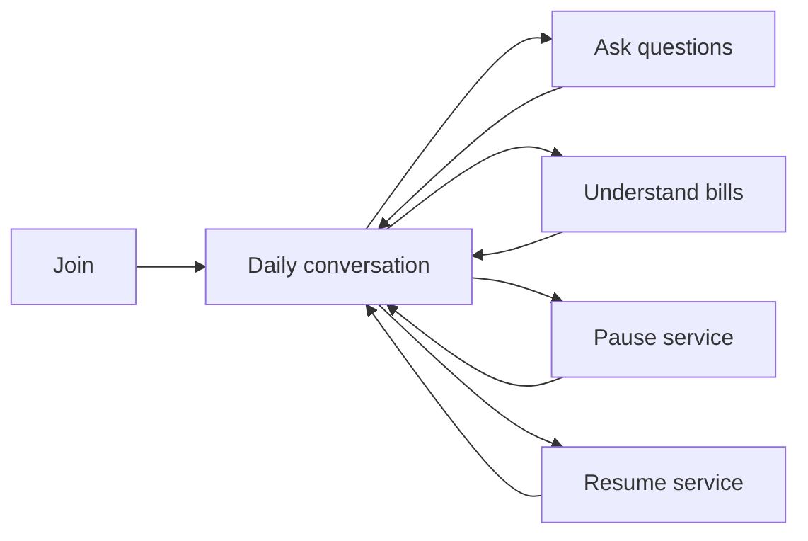
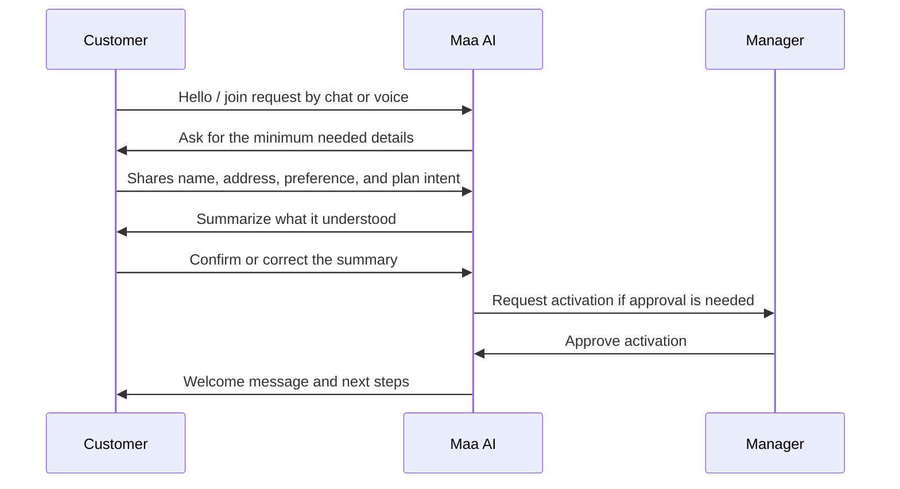
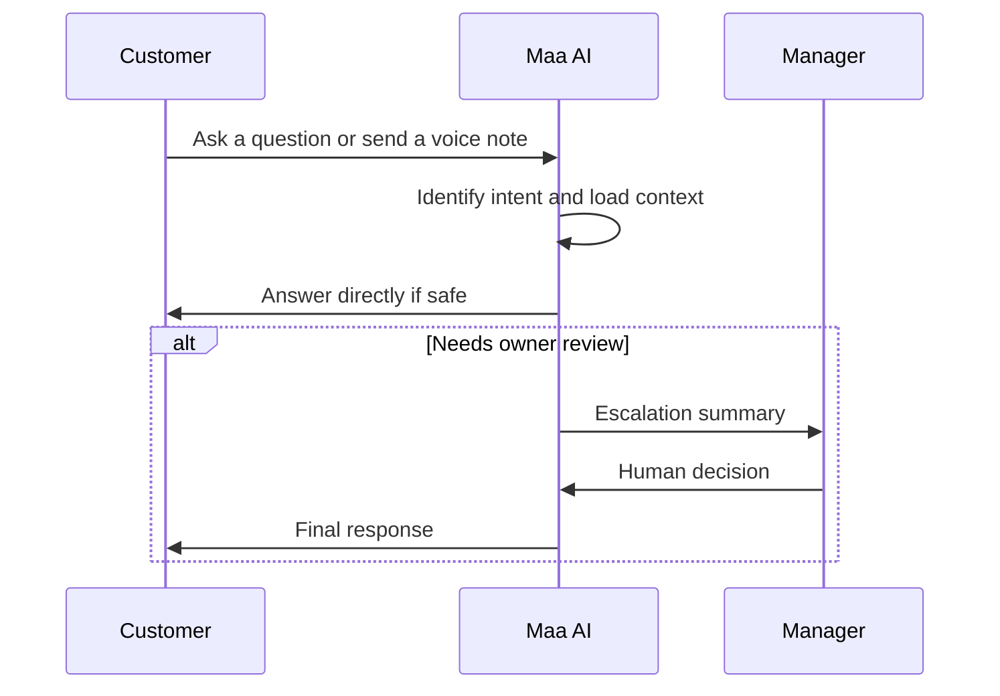
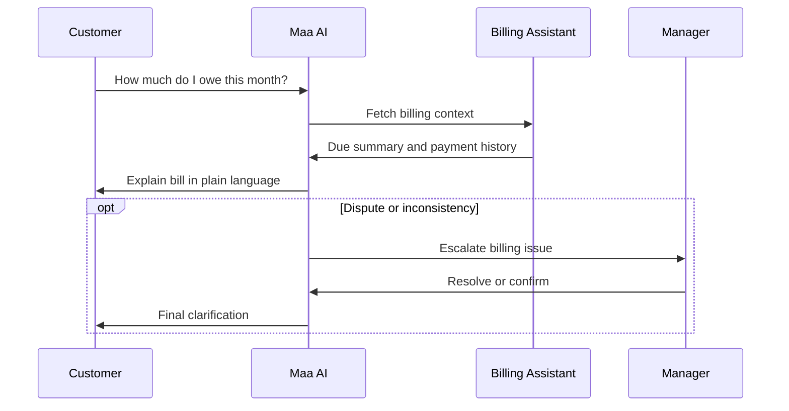
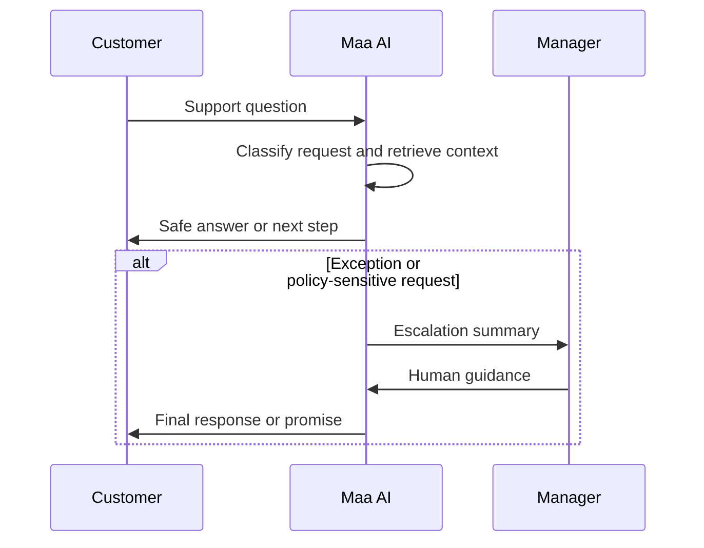
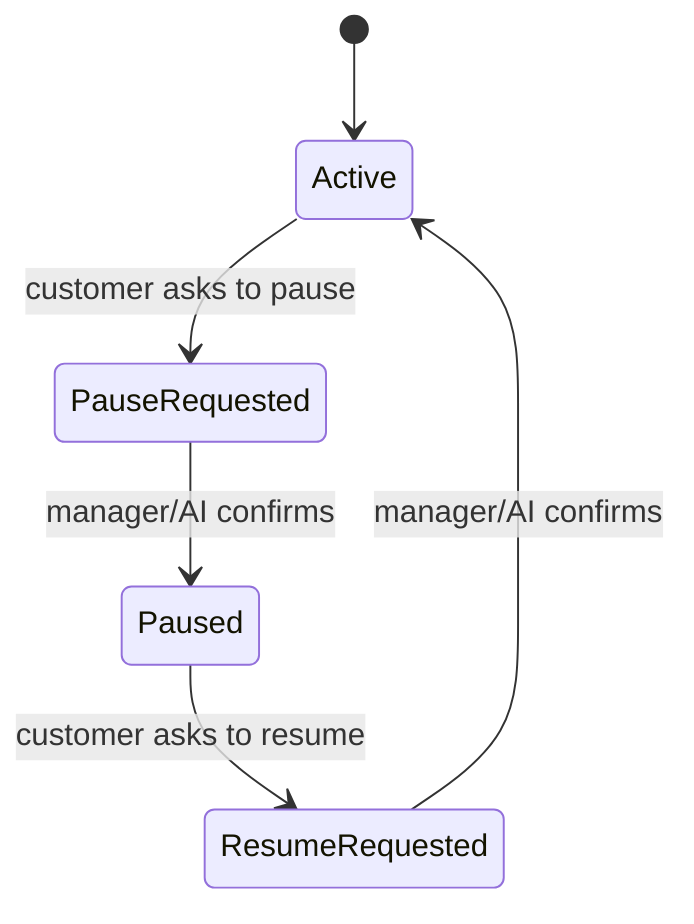
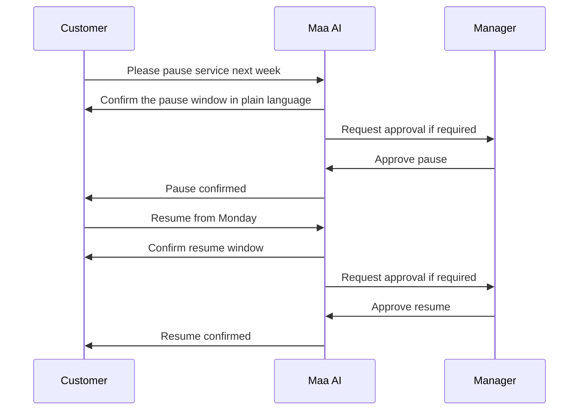
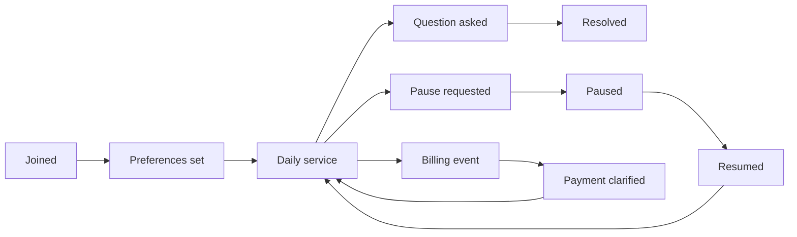
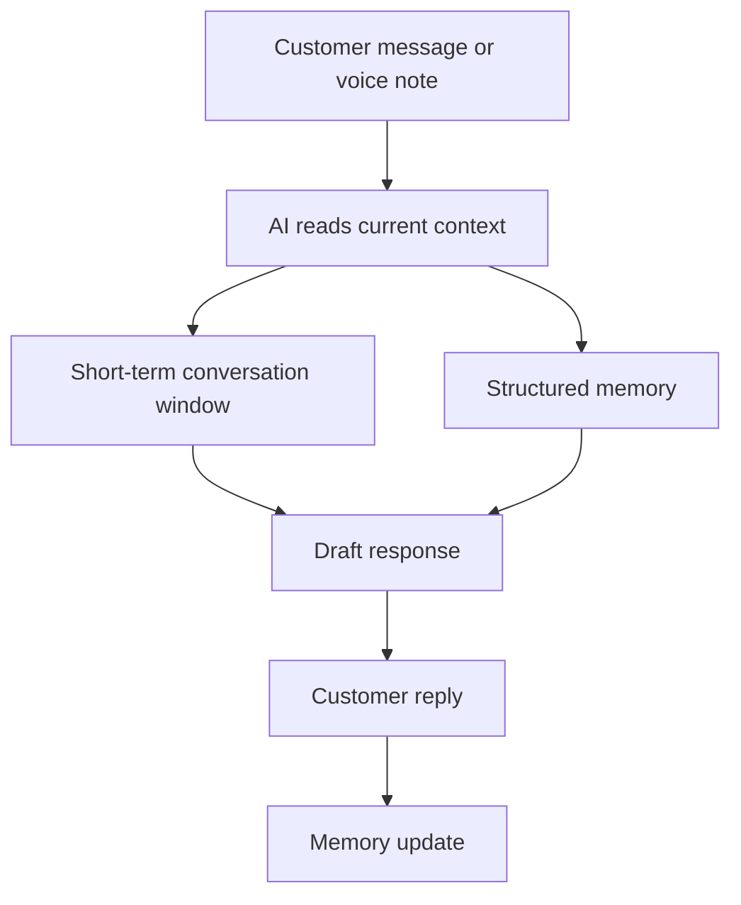
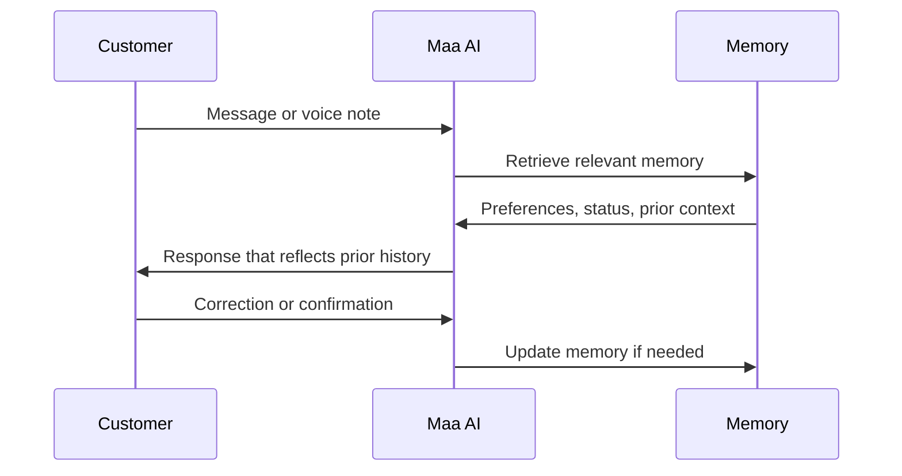

# Maa Sharda AI Customer Experience

This document defines the complete customer experience for Maa Sharda AI.

The experience is designed to be chat-first and voice-first. Traditional forms should be avoided wherever possible. When structure is needed, the customer should confirm short prompts, chips, or quick choices rather than fill long forms.

## Experience Goals

- Let customers join without friction
- Let customers speak or chat naturally
- Let customers pause and resume service easily
- Let customers ask questions without waiting for the owner to manually respond every time
- Let customers understand their bills clearly
- Keep the experience human, familiar, and low-effort

## Experience Rules

1. Conversation is the default interface.
2. Voice is a first-class input.
3. Forms are a fallback, not the starting point.
4. The system should confirm important details in plain language.
5. The customer should always know what the business has understood.
6. Sensitive actions should require explicit confirmation.
7. The system should remember context so customers do not repeat themselves.

## Customer Journey Overview

### Existing

- Customers can currently view their status and billing through the app.
- Communication is still largely owner-led.

### Planned

- Customers can chat, speak, join, pause, resume, ask questions, and understand bills through AI-guided conversation.

### Future

- The customer experience becomes proactive, memory-aware, and mostly conversational across channels.

## 1. Onboarding

Onboarding should feel like a conversation, not a data-entry task.

### Existing

- The owner creates or updates customer information manually.
- The customer experience starts after registration.

### Planned

- The customer joins by chat or voice.
- The system asks for the minimum needed details in short steps.
- The system repeats back what it understood.
- The customer confirms or corrects the summary.
- The owner approves activation when needed.

### Future

- Onboarding becomes a guided conversation that can be completed in a few messages or one voice exchange.

### Onboarding Inputs

- Name
- Phone number or channel identity
- Address
- Meal preference
- Plan intent
- Consent to receive service communication

### Onboarding Outputs

- Draft customer profile
- Confirmed contact details
- Service preference summary
- Activation request when required

### Onboarding Flow

## 2. Daily Interaction

Daily interaction is the ongoing conversation layer.

Customers should be able to:

- Chat about menu or service
- Speak instead of typing
- Ask questions about their plan, meals, or status
- Receive concise replies without navigating complex screens

### Existing

- Customers can view today’s status, menu, payment, and alerts.

### Planned

- Customers can ask questions in natural language.
- The AI responds using customer context and business policy.
- The customer can switch between chat and voice without losing context.

### Future

- Daily interaction becomes a persistent relationship thread where the system anticipates common questions and repeats less.

### Daily Interaction Inputs

- Customer message or voice transcript
- Current plan
- Today’s menu
- Payment status
- Service notes
- Conversation memory

### Daily Interaction Outputs

- Answer
- Clarification request
- Escalation note
- Short status summary

### Daily Interaction Flow

## 3. Billing Interaction

Billing should be understandable without forcing the customer to inspect a complex ledger.

The customer should see:

- What is due
- What has already been paid
- What the current month status means
- How to ask for clarification in plain language

### Existing

- Customers can see payment status and send a payment confirmation message.

### Planned

- The AI explains bills conversationally.
- The AI can answer “How much do I owe?” and “What did I pay already?”
- Billing language is short, simple, and traceable.

### Future

- Billing becomes a conversational explanation layer with memory of prior questions and disputes.

### Billing Inputs

- Monthly dues
- Confirmed payments
- Partial payments
- Billing month
- Any pending exceptions

### Billing Outputs

- Plain-language bill summary
- Due amount explanation
- Payment status explanation
- Escalation if the ledger is inconsistent

### Billing Flow

## 4. Support

Support should feel like asking a person for help, not opening a ticketing system.

The customer should be able to ask:

- What is today’s menu?
- Why is my bill this amount?
- Can I pause service?
- Can I resume service?
- What is the status of my request?

### Existing

- Support is mostly owner-led and manual.

### Planned

- The AI handles routine questions and routes unusual cases to the owner.
- The AI uses the customer’s history to avoid repeated explanations.

### Future

- Support becomes a guided conversation that can resolve simple cases end-to-end.

### Support Inputs

- Customer question
- Relationship history
- Relevant policy
- Pending approvals or open cases

### Support Outputs

- Direct answer
- Suggested next step
- Owner escalation summary

### Support Flow

## 5. Pause and Resume

Pause and resume should be fast, low-friction, and confirmable in conversation.

The customer should not need a long form to pause service for a few days or resume again later.

### Existing

- Pauses exist in the business data model and are managed by the owner.

### Planned

- The customer can request pause or resume by chat or voice.
- The AI confirms the dates or change window in plain language.
- The system routes the change for approval if required.

### Future

- Pause and resume become simple conversational commands with built-in memory of prior service windows.

### Pause/Resume Inputs

- Customer request
- Preferred dates or time window
- Active service state
- Policy rules

### Pause/Resume Outputs

- Confirmation summary
- Pending approval request if needed
- Updated service note when confirmed

### Pause/Resume Flow

## 6. Relationship Timeline

The customer relationship should be treated as a timeline, not a static profile.

What matters on the timeline:

- Join date
- Preference changes
- Pauses and resumes
- Billing events
- Important questions
- Issues and resolutions
- Tone or relationship notes

### Existing

- The product stores customer records and payment data.

### Planned

- The customer timeline becomes a readable history of the relationship.
- The AI uses this timeline to answer questions consistently.

### Future

- The timeline becomes the shared memory of the business relationship.

### Relationship Timeline Flow

## 7. Conversation Memory

Conversation memory should help the customer feel recognized without forcing them to repeat themselves.

The system should remember only what is useful and safe:

- Name and contact identity
- Address and service area context
- Plan and service status
- Meal preferences
- Known pause windows
- Prior unresolved questions
- Billing state summary
- Tone or relationship notes when relevant

### Existing

- Memory is mostly implicit in the business’s chat history and the app data.

### Planned

- The AI compresses conversation history into structured memory.
- The AI retrieves only the relevant memory for the current exchange.

### Future

- Memory becomes a controlled relationship layer that helps the business speak consistently over time.

### Memory Rules

1. Prefer short summaries over long transcripts.
2. Prefer confirmed facts over inferred facts.
3. Mark stale memory when a customer corrects it.
4. Do not surface unnecessary private data.
5. Use memory to reduce repetition, not to surprise the customer.

### Conversation Memory Flow

## Customer Interaction Contract

The customer experience should always support these actions:

- Chat
- Speak
- Join
- Pause
- Resume
- Ask questions
- Understand bills

The customer should never need to navigate a complex form to get help with routine service questions.

## Design Principles

1. Make the conversation the interface.
2. Treat voice as equal to text.
3. Keep confirmations short and explicit.
4. Let memory reduce repetition.
5. Make bills understandable in plain language.
6. Make pause and resume conversational.
7. Escalate exceptions instead of guessing.
8. Preserve trust over speed.
9. Keep customer state visible in the relationship timeline.
10. Do not add form-heavy workflows unless there is no safer alternative.
