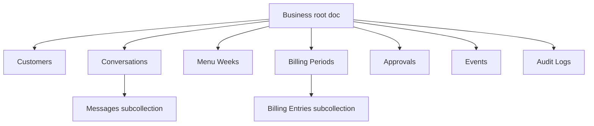

# Maa Sharda AI Firestore Schema Redesign

This schema is designed for a communication-first, event-driven product.

Goals:

- Minimize reads
- Keep billing reliable
- Preserve a complete audit trail
- Support approval workflows
- Keep customer memory structured and lightweight
- Avoid unnecessary collections

## Architecture Summary

The database should use one business root document and a small set of purpose-built collections under that business.

### Existing

- Customers, orders, payments, menu, notifications, and settings exist in the current app.

### Planned

- Use materialized views for current state.
- Use append-only events for history.
- Store conversation memory inside customer and conversation documents instead of a separate memory collection.
- Derive inbox and dashboard views from existing collections.

### Future

- Support multiple businesses by keeping every collection under `businesses/{businessId}`.
- Split hot collections into monthly or weekly partitions only if scale requires it.

## Design Rules

1. Store current state in small materialized view documents.
2. Store history in append-only event or entry collections.
3. Put memory inside existing documents instead of creating a separate memory collection.
4. Avoid duplicating data unless it reduces reads or improves reliability.
5. Keep all business data under a tenant path.
6. Read summaries first, drill into detail only when needed.

## Collection 1: `businesses/{businessId}`

Purpose:
The tenant root document. It replaces the current scattered settings pattern and holds business-wide policy, AI settings, and global config in one read.

Fields:
- `name`
- `timezone`
- `currency`
- `ownerName`
- `ownerPhone`
- `communicationTone`
- `approvalPolicy`
- `billingPolicy`
- `featureFlags`
- `activeMenuWeekId`
- `createdAt`
- `updatedAt`
- `schemaVersion`

Indexes:
- Document ID lookup only
- No composite index needed for the singleton document itself

Read frequency:
- Very high
- Read on almost every authenticated session and dashboard load

Write frequency:
- Very low
- Only when the owner changes business policy, tone, or configuration

Security considerations:
- Owner-only write access
- Read access limited to authenticated members of the business
- Do not store secrets that need client-side hiding
- Store only policy, not raw credentials

Future scalability:
- If the business grows, split rare config into subdocuments such as `businesses/{businessId}/config/*` without changing the rest of the schema

## Collection 2: `businesses/{businessId}/customers`

Purpose:
Canonical customer profile and relationship state.

This is the main customer projection. It should carry enough summary data for the dashboard and customer experience without forcing extra joins.

Fields:
- `name`
- `phone`
- `address`
- `plan`
- `foodPreference`
- `rate`
- `active`
- `paused`
- `pauseFrom`
- `pauseTo`
- `preferredChannel`
- `consentStatus`
- `relationshipSummary`
- `memorySummary`
- `lastConversationAt`
- `lastBillingPeriodId`
- `billingStatus`
- `openIssueCount`
- `tags`
- `searchKey`
- `createdAt`
- `updatedAt`
- `sourceEventId`

Indexes:
- `phone` equality lookup
- `active + updatedAt` for owner views
- `active + paused + updatedAt` for triage lists
- `billingStatus + updatedAt` for billing follow-up
- `searchKey` or `name` for search-driven lookup

Read frequency:
- Very high
- Used by owner dashboard, customer support, billing summaries, and customer lookup

Write frequency:
- Medium
- Writes happen on onboarding, pause/resume, billing-related updates, and memory refreshes

Security considerations:
- Customer may read only their own record
- Customer may not write sensitive fields directly
- Owner and server-side AI writes must be validated by policy
- Relationship and memory summaries must exclude unnecessary PII

Future scalability:
- Add per-customer derived summaries only if they reduce repeated cross-collection reads
- Keep this document small enough to read frequently

## Collection 3: `businesses/{businessId}/conversations`

Purpose:
Conversation thread projection for customer communication.

This is the owner-facing and AI-facing view of each ongoing thread.

Fields:
- `customerId`
- `channel`
- `status`
- `subject`
- `lastMessageAt`
- `lastMessagePreview`
- `lastSenderType`
- `unreadOwnerCount`
- `summary`
- `memorySummary`
- `lastIntent`
- `riskLevel`
- `pendingApprovalId`
- `assignedTo`
- `createdAt`
- `updatedAt`
- `lastEventId`

Indexes:
- `status + lastMessageAt desc`
- `customerId + updatedAt desc`
- `channel + status + lastMessageAt desc`
- `pendingApprovalId` equality lookup

Read frequency:
- High
- Used by the AI inbox, customer support, and the owner dashboard

Write frequency:
- High
- Updated whenever a message arrives, a summary changes, or a risk state changes

Security considerations:
- Customer can read only conversations that belong to them
- Customer writes should be limited to message append actions, not thread metadata
- AI writes to summary and risk fields should be server-only

Future scalability:
- If volume grows, partition by channel or month only for cold storage; keep active threads easy to query

## Collection 4: `businesses/{businessId}/conversations/{conversationId}/messages`

Purpose:
Append-only conversation history.

This is the raw communication log. The parent conversation document should hold the summary so the UI does not need to read every message on every load.

Fields:
- `senderType` (`customer`, `owner`, `ai`, `system`)
- `senderId`
- `channel`
- `messageType` (`text`, `voice`, `transcript`, `summary`)
- `body`
- `transcript`
- `intent`
- `riskLevel`
- `approvalId`
- `eventId`
- `createdAt`
- `messageStatus`
- `attachments`

Indexes:
- `createdAt asc/desc` within the conversation
- `senderType + createdAt desc`
- `messageType + createdAt desc`

Read frequency:
- Medium for active threads
- Low for historical review because summaries should satisfy most cases

Write frequency:
- High
- Every message append creates a new document

Security considerations:
- Append-only; do not edit message history unless policy explicitly allows redaction
- Customer can append only to their own conversation
- Server-side AI should create its own messages through a controlled write path

Future scalability:
- If threads become long, archive older message ranges after their content is summarized into the parent conversation document

## Collection 5: `businesses/{businessId}/menuWeeks`

Purpose:
Weekly menu planning and publication.

Menu is a communication artifact, not an operational admin feature. It should be easy to read and cheap to query.

Fields:
- `weekStart`
- `weekEnd`
- `days`
- `summary`
- `specialNotes`
- `publishedAt`
- `updatedAt`
- `sourceVersion`
- `active`

Indexes:
- `weekStart` unique lookup
- `active + publishedAt desc`
- `updatedAt desc`

Read frequency:
- Medium
- Read by customers and the owner dashboard

Write frequency:
- Low
- Updated once per week or when the owner changes the plan

Security considerations:
- Owner and approved AI only
- Customers get read-only access
- Keep the document small so customers can load it cheaply

Future scalability:
- If multiple menu variants are introduced later, add a variant field rather than a separate collection

## Collection 6: `businesses/{businessId}/billingPeriods`

Purpose:
Monthly billing summary and reliable current-state projection.

This is the billing truth surface the dashboard and customer experience should read first.

Fields:
- `customerId`
- `periodKey`
- `rateSnapshot`
- `openingBalance`
- `chargesTotal`
- `paymentsTotal`
- `adjustmentsTotal`
- `dueAmount`
- `status`
- `lastPaymentAt`
- `lastReminderAt`
- `disputeStatus`
- `summary`
- `calculatedAt`
- `lastEventId`
- `updatedAt`

Indexes:
- `customerId + periodKey` unique lookup
- `status + dueAmount desc`
- `updatedAt desc`
- `disputeStatus + updatedAt desc`

Read frequency:
- High
- Used by customer billing screens, owner dashboard, and AI billing summaries

Write frequency:
- Medium
- Updated when payments, adjustments, or disputes occur

Security considerations:
- Customer may read only their own billing period summaries
- Financial writes must be server-side and approval-aware
- Do not expose internal adjustment reasons unless the policy allows it

Future scalability:
- If needed, split billing periods by month only after a single document no longer fits the access pattern

## Collection 7: `businesses/{businessId}/billingPeriods/{periodId}/entries`

Purpose:
Append-only billing ledger entries.

This subcollection holds the source events for the billing period summary.

Fields:
- `entryType` (`payment`, `charge`, `adjustment`, `waiver`, `correction`)
- `amount`
- `sourceType`
- `sourceId`
- `approvedBy`
- `createdBy`
- `createdAt`
- `balanceAfter`
- `customerVisibleNote`
- `riskLevel`

Indexes:
- `createdAt asc/desc`
- `entryType + createdAt desc`
- `sourceType + sourceId`

Read frequency:
- Low to medium
- Read only when a bill needs detailed explanation or reconciliation

Write frequency:
- High when billing activity occurs
- Append only

Security considerations:
- Append-only ledger
- Server-side writes only
- Require approval metadata for sensitive entry types
- Never allow client-side edits to historical entries

Future scalability:
- Partition by month if volume becomes large, but keep the period summary document as the primary read surface

## Collection 8: `businesses/{businessId}/approvals`

Purpose:
Queue for human decisions on AI-proposed actions.

This is the hard boundary between AI suggestions and business-changing actions.

Fields:
- `proposedActionType`
- `riskLevel`
- `status`
- `requestedByType`
- `requestedById`
- `targetRef`
- `summary`
- `diffPreview`
- `requiredFields`
- `reason`
- `createdAt`
- `decidedAt`
- `decidedBy`
- `expiryAt`
- `relatedConversationId`
- `relatedEventId`
- `lastEventId`

Indexes:
- `status + createdAt desc`
- `status + riskLevel + createdAt desc`
- `targetRef` equality lookup
- `relatedConversationId + createdAt desc`

Read frequency:
- High on the owner dashboard
- Low elsewhere

Write frequency:
- Medium
- Created when AI needs approval; updated when the owner decides

Security considerations:
- Owner-only decision rights
- AI may create requests but may not resolve them
- Keep the preview plain-language and bounded

Future scalability:
- If approvals become common, add queue prioritization fields rather than new approval collections

## Collection 9: `businesses/{businessId}/events`

Purpose:
Append-only event stream for event sourcing.

This is the source of truth for changes. Customer, billing, and conversation documents are projections from this stream.

Fields:
- `eventType`
- `aggregateType`
- `aggregateId`
- `sequence`
- `actorType`
- `actorId`
- `channel`
- `payloadSummary`
- `payloadRef`
- `correlationId`
- `causationId`
- `dedupeKey`
- `schemaVersion`
- `processingStatus`
- `createdAt`
- `processedAt`

Indexes:
- `aggregateType + aggregateId + sequence asc`
- `eventType + createdAt desc`
- `processingStatus + createdAt asc`
- `correlationId` equality lookup

Read frequency:
- Low for human users
- High for processors, replay, and AI orchestration

Write frequency:
- Very high
- Every meaningful business action should emit an event

Security considerations:
- Append-only
- Server-side write only
- Never allow clients to rewrite old events
- Use dedupe keys to prevent duplicate processing

Future scalability:
- If the event stream grows very large, shard by month or use per-aggregate subcollections, but keep the logical event contract unchanged

## Collection 10: `businesses/{businessId}/auditLogs`

Purpose:
Immutable operational audit trail for AI and human actions.

Audit logs are for trust, debugging, and incident review. They should not be used as the primary business state.

Fields:
- `actionType`
- `actorType`
- `actorId`
- `capability`
- `promptVersion`
- `toolCalls`
- `approvalId`
- `eventId`
- `beforeSummary`
- `afterSummary`
- `riskLevel`
- `outcome`
- `costEstimate`
- `latencyMs`
- `createdAt`

Indexes:
- `actionType + createdAt desc`
- `actorType + createdAt desc`
- `approvalId` equality lookup
- `eventId` equality lookup

Read frequency:
- Low
- Read mainly during incident review or support investigation

Write frequency:
- High
- Every AI capability invocation and sensitive write should log once

Security considerations:
- Append-only
- Server-side write only
- Be careful not to store secrets or raw sensitive payloads
- Keep summaries concise but sufficient for review

Future scalability:
- If logs become large, move older records to cheaper archival storage while keeping a short hot window in Firestore

## What Is Not a Separate Collection

To keep the schema lean, these should be embedded or derived instead of stored in their own dedicated collection:

- Conversation memory: keep in `customers.memorySummary` and `conversations.memorySummary`
- Inbox: derive from conversations, approvals, and events
- Notifications: derive from conversation updates and billing or approval events when possible
- Tasks: derive from approvals and event-driven follow-up rather than a separate task system unless scale demands it

## Read Path Strategy

The default reads should be cheap:

- Owner dashboard reads the business doc, customer summaries, conversation summaries, billing period summaries, and approvals
- Customer app reads the customer record, active conversation summary, current menu week, and billing period summary
- Detailed message history is only read when a thread is opened
- Billing entries are only read when a bill needs explanation or reconciliation

## Write Path Strategy

The write model should be reliable:

- Every meaningful change emits an event
- The event updates the relevant projection documents
- Sensitive actions write to approvals first when needed
- All writes generate audit logs

## Why This Schema Works

- It keeps the product communication-first instead of CRUD-first
- It uses one business root and a small number of high-value collections
- It stores memory where it will be read, not in a separate memory silo
- It supports event sourcing without requiring every screen to read the event stream
- It makes billing reliable by separating summary and ledger entries
- It keeps approvals explicit and visible
- It gives the owner and AI a low-read path for daily operations
