# Maa Sharda AI Manager Dashboard

The manager dashboard is the AI-first homepage for the business owner.

It should feel closer to Linear, Notion, CRED, and Perplexity than to a traditional admin panel. The goal is not to expose every data table. The goal is to help the owner understand what matters now, take the next best action, and stay out of the weeds.

## Design Goals

- Reduce cognitive load
- Surface the few things that matter right now
- Let the owner ask for what they need in natural language
- Turn routine decisions into one-click or one-command actions
- Keep the homepage focused on judgment, not data entry
- Avoid tab overload, dense grids, and CRUD-first navigation

## Design Principles

1. The homepage is a briefing surface, not a reporting dashboard.
2. AI is the default entry point.
3. Actions should be searchable by language, not buried in menus.
4. Numbers should be explained, not just displayed.
5. The dashboard should help the owner think, not just browse.
6. High-risk actions should appear only when they need review.
7. The UI should prefer signal over completeness.

## Dashboard Shape

The dashboard should have one primary home view with a few high-signal zones:

- Morning Briefing
- AI Inbox
- Business Health
- Today’s Priorities
- Pending Approvals
- Revenue
- Customers
- AI Chat
- Natural language commands

### Existing

- The owner can already view business data in a role-based app.
- The current experience is closer to operational management than AI-led decision support.

### Planned

- The homepage becomes the default owner experience.
- AI generates the briefing, inbox triage, priority list, and action suggestions.

### Future

- The dashboard becomes a command center that anticipates the owner’s next question.

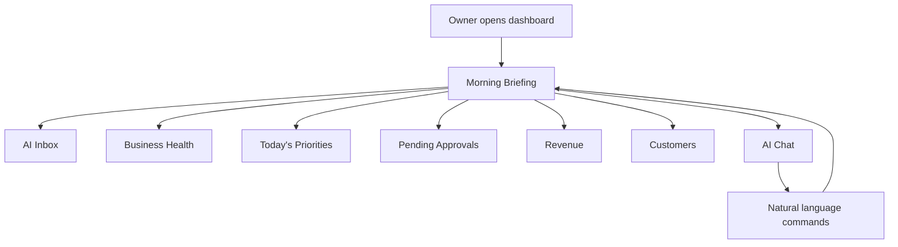

## Homepage Information Hierarchy

The dashboard should be arranged in descending order of urgency and decision value.

1. Morning Briefing
2. Today’s Priorities
3. Pending Approvals
4. AI Inbox
5. Business Health
6. Revenue
7. Customers
8. AI Chat

This order is intentional. It keeps attention on decisions before exploration.

## 1. Morning Briefing

Purpose:
Give the owner a 30-second summary of what matters today.

What it should answer:

- What changed since yesterday?
- What needs attention today?
- What is blocked?
- What deserves approval?

Tone:
- Short
- Confident
- Actionable
- Not verbose

### Existing

- The owner can inspect status in the app, but there is no AI briefing layer.

### Planned

- AI generates a concise morning brief from business events, billing state, open messages, and approvals.

### Future

- The briefing adapts to the owner’s habits and highlights recurring patterns.

### Morning Briefing Inputs

- Open approvals
- Unread customer messages
- Billing exceptions
- Revenue snapshot
- Today’s planned work
- Relationship risks

### Morning Briefing Outputs

- One-screen summary
- Top 3 actions
- Risk flags
- Suggested follow-up

### Morning Briefing Flow

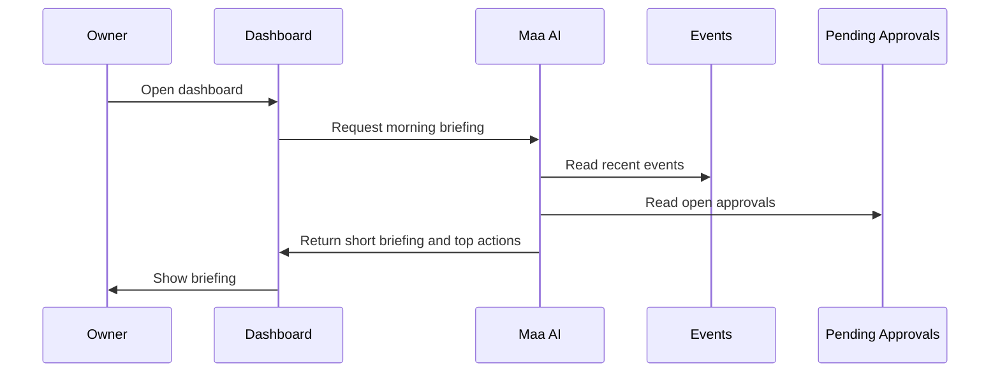

## 2. AI Inbox

Purpose:
Turn the owner’s operational noise into a prioritized queue of customer and business conversations.

The AI Inbox is not a full email client. It is a filtered, ordered, and summarized attention queue.

What it should contain:

- New customer questions
- Requests that need a decision
- Billing disputes
- Pause or resume requests
- Cases needing a human reply

### Existing

- Customer communication exists, but it is not shaped into a structured inbox for the owner.

### Planned

- AI groups incoming items by topic, urgency, and required action.
- The owner sees summaries instead of raw message dumps.

### Future

- AI learns which inbox items the owner usually handles personally and which can be delegated.

### AI Inbox Inputs

- Customer messages
- Voice transcripts
- Open tasks
- Pending approvals
- Escalation labels

### AI Inbox Outputs

- Prioritized list
- One-line summary per item
- Suggested response
- Suggested action owner can take

### AI Inbox Flow

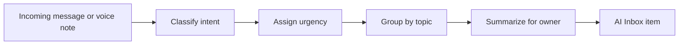

## 3. Business Health

Purpose:
Show whether the business is healthy without forcing the owner into raw reports.

Business Health should answer:

- Is the business calm or reactive?
- Are there unusual billing issues?
- Are there too many unresolved customer concerns?
- Is today on track?

### Existing

- The app shows operational stats, but not a single health interpretation.

### Planned

- AI turns raw activity into health signals and plain-language observations.

### Future

- The dashboard predicts stress before it becomes visible in customer messages.

### Business Health Inputs

- Revenue trend
- Open approvals
- Unresolved inbox items
- Billing exceptions
- Customer churn or pause signals
- Event volume

### Business Health Outputs

- Health label
- Short explanation
- Concern list
- Suggested check-in items

### Business Health Flow

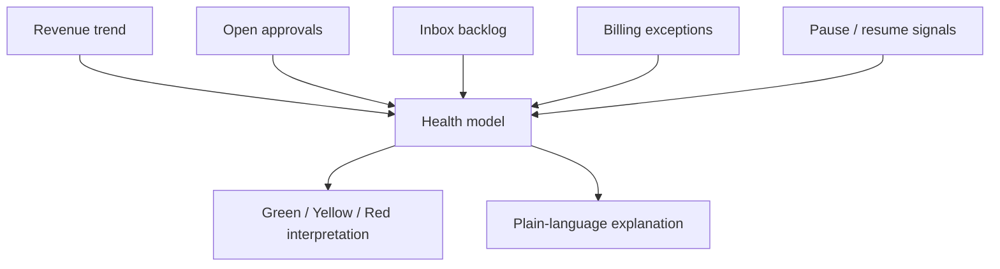

## 4. Today’s Priorities

Purpose:
Help the owner choose the next best action without scanning the whole system.

This section should feel like a ranked list, not a task board.

Examples of priority types:

- Reply to a customer waiting on a decision
- Review a billing exception
- Approve a pause or resume
- Resolve a blocked onboarding item
- Send one important message

### Existing

- The owner can navigate through tabs and records, but priorities are not synthesized.

### Planned

- The AI creates a short, ranked list based on urgency, impact, and dependency.

### Future

- Priorities become predictive and context-aware based on the owner’s work patterns.

### Today’s Priorities Inputs

- Open approvals
- Unread inbox items
- Billing anomalies
- Recent customer changes
- Revenue-sensitive events

### Today’s Priorities Outputs

- Ranked list of actions
- Why each item matters
- Estimated effort
- Suggested owner action

### Today’s Priorities Flow

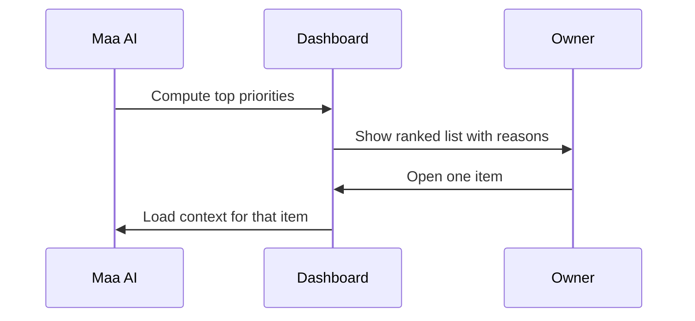

## 5. Pending Approvals

Purpose:
Show only the actions that require the owner’s decision.

This should be highly visible, because it is where the AI stops and the human starts.

### Existing

- Approval handling exists as a product direction, but not yet as an owner homepage surface.

### Planned

- Pending approvals are surfaced on the homepage with plain-language summaries and explicit consequences.

### Future

- The system may sort approvals by urgency and likely impact, but it should never hide them.

### Pending Approvals Inputs

- Proposed action
- Risk score
- Relevant customer context
- Billing context
- AI explanation

### Pending Approvals Outputs

- Approve
- Edit
- Reject
- Request more context

### Pending Approvals Flow

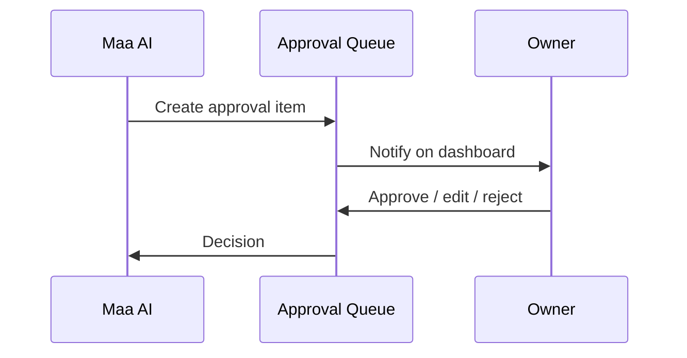

## 6. Revenue

Purpose:
Make money visible without turning the dashboard into a finance console.

Revenue should be presented as:

- Current month snapshot
- Collected vs due
- Simple trend direction
- Any exception that affects confidence in the number

### Existing

- The owner can inspect billing data and payment status.

### Planned

- Revenue becomes an interpreted block with short commentary, not a raw ledger table.

### Future

- The dashboard highlights revenue patterns and anomalies proactively.

### Revenue Inputs

- Payments collected
- Dues outstanding
- Month context
- Billing exceptions

### Revenue Outputs

- Revenue snapshot
- Collection ratio
- Trend direction
- Risk note if data is incomplete

### Revenue Flow

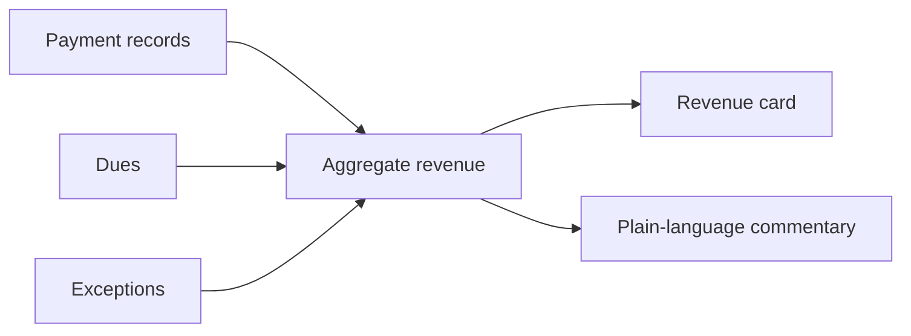

## 7. Customers

Purpose:
Give the owner a relationship view of customers, not a spreadsheet view.

The customer section should answer:

- Who needs attention?
- Who is new?
- Who is paused?
- Who has a billing issue?
- Who has repeated service questions?

### Existing

- Customer records exist in the app.

### Planned

- The dashboard shows relationship-relevant customer groups and notable changes.

### Future

- The customer list becomes a set of relationship signals and search entry points.

### Customers Inputs

- Customer profile data
- Conversation history
- Billing status
- Pause or resume status
- Relationship memory

### Customers Outputs

- Customer groups
- At-risk list
- New or changed customers
- Search results with AI summary

### Customers Flow

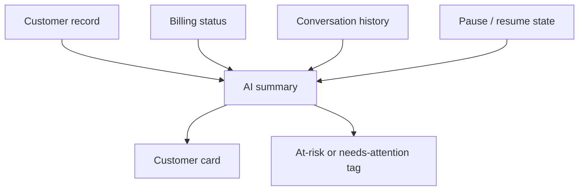

## 8. AI Chat

Purpose:
Give the owner a direct, Perplexity-like conversational layer over the business.

AI Chat should answer questions such as:

- What changed today?
- Which customers need attention?
- Why is revenue down?
- What approvals are waiting?
- Draft a reply for this customer.

### Existing

- The owner can act through screen navigation and records.

### Planned

- AI Chat becomes a first-class home element and can take natural language commands.

### Future

- AI Chat becomes the default way to interrogate the business and generate action drafts.

### AI Chat Inputs

- Owner question
- Dashboard context
- Business memory
- Relevant records

### AI Chat Outputs

- Answer
- Recommendation
- Draft message
- Action plan

### AI Chat Flow

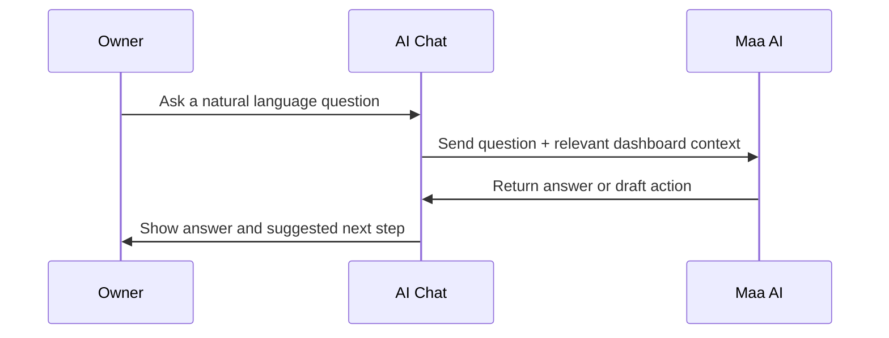

## 9. Natural Language Commands

Purpose:
Let the owner act without searching for menus.

Examples of command intent:

- Show today’s priorities
- Draft a customer reply
- Explain this customer’s bill
- Review pending approvals
- Summarize today’s inbox

The command layer should feel like a command palette plus chat, not like a form or settings drawer.

### Existing

- Actions are mostly discovered through UI navigation.

### Planned

- The owner can issue commands in plain language.
- The system maps them to the correct capability and action.

### Future

- The dashboard becomes increasingly command-driven as confidence and policy improve.

### Natural Language Command Flow

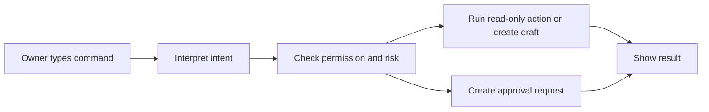

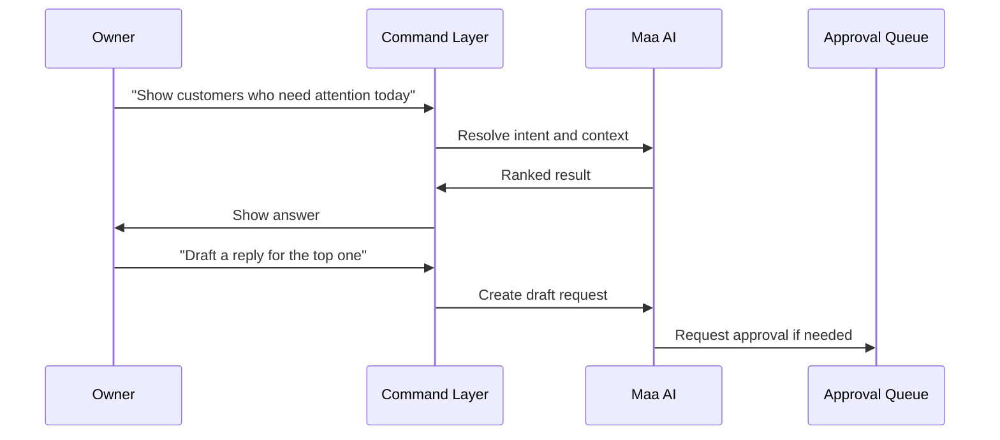

## Layout Strategy

The dashboard should feel calm, not crowded.

Recommended structure:

- Top bar: brief identity, search, command entry
- Main column: briefing, priorities, inbox, approvals
- Secondary column or stacked sections: revenue, customers, health
- AI chat anchored visibly, not hidden behind navigation

### Layout Rules

- Use progressive disclosure for details
- Collapse secondary data by default
- Keep the homepage scannable in one glance
- Make the first screen usable on laptop and phone
- Avoid endless tab switching

## Cognitive Load Rules

1. Do not show all data at once.
2. Do not make the owner interpret raw tables to understand the business.
3. Do not bury approvals.
4. Do not make AI chat feel like a separate product.
5. Do not require the owner to remember where a function lives.
6. Do not prioritize feature breadth over clarity.

## Success Metrics

- Time to understand the day’s situation
- Time to find the next action
- Number of tasks resolved from the homepage
- Number of approvals handled without hunting
- Reduction in navigation depth
- Owner satisfaction with clarity

## Non Goals

- A full CRUD admin interface
- A spreadsheet-style backend console
- Deep analytics dashboards with many charts
- Delivery management as a primary surface
- Feature bloat
- Excessive tab count

## Relationship To the Rest of the Product

### Existing

- The dashboard sits on top of the current manager data model.

### Planned

- AI powers briefing, inbox triage, priorities, approvals, and command interpretation.

### Future

- The dashboard becomes the owner’s main operating surface for the business relationship layer.
