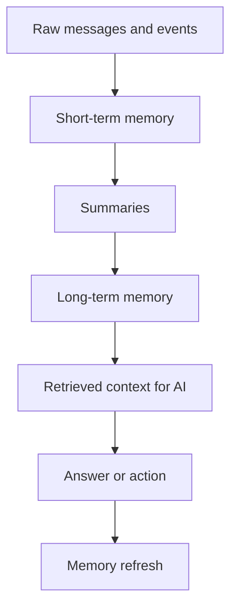
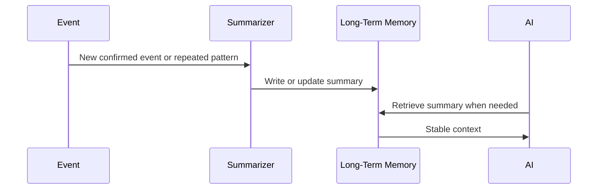
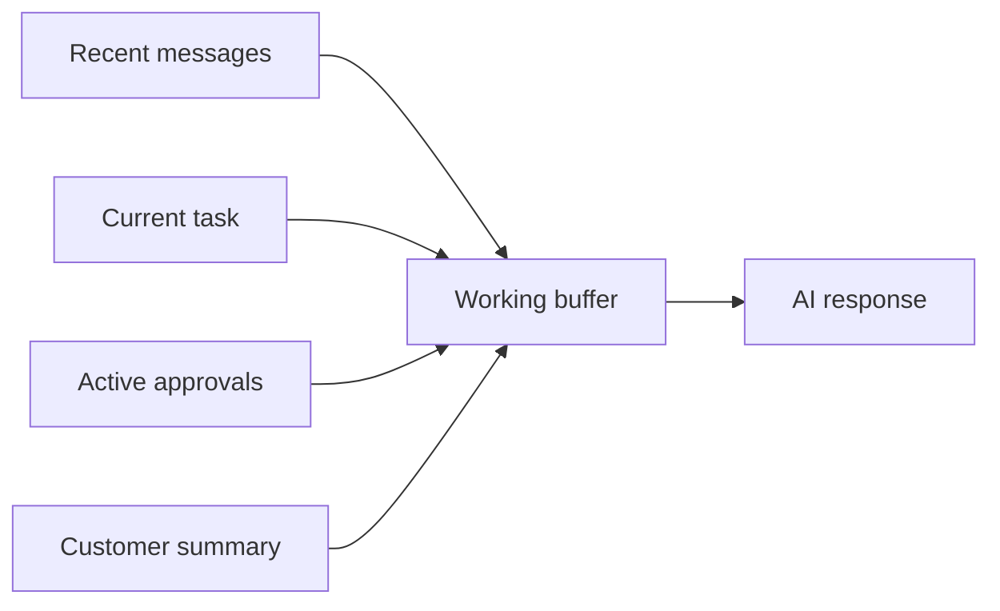
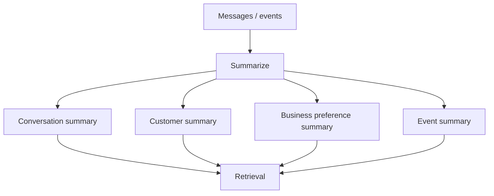
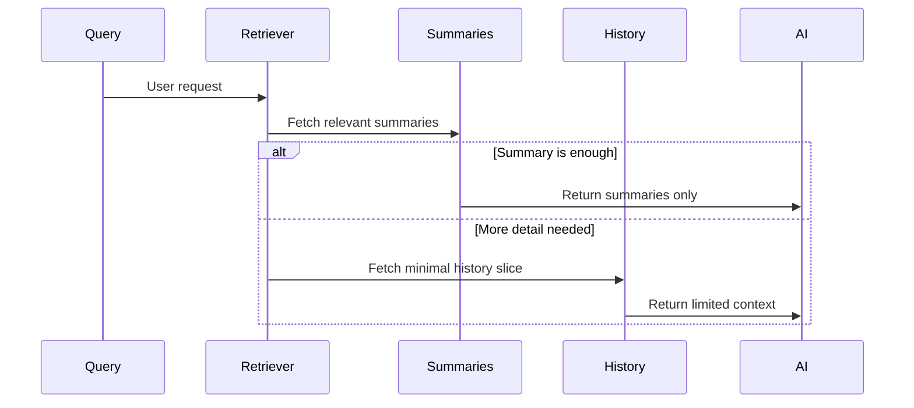
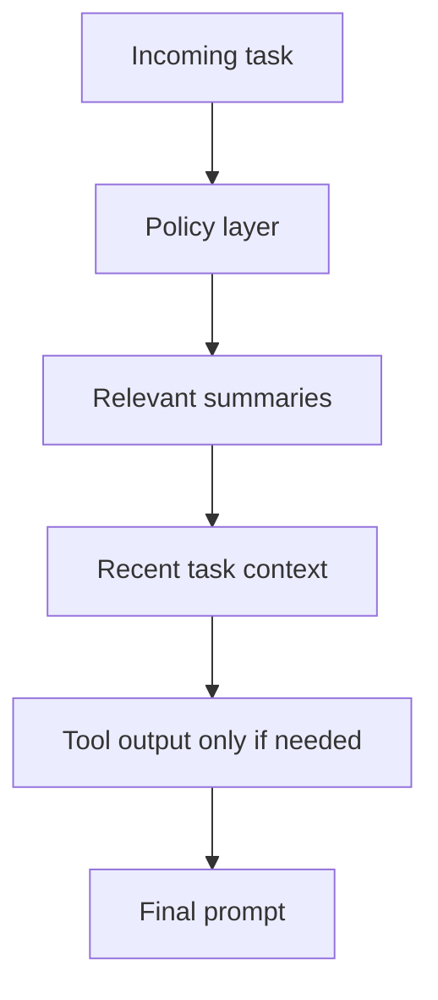
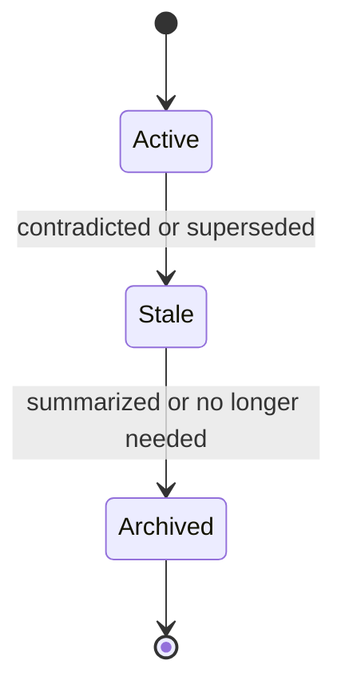
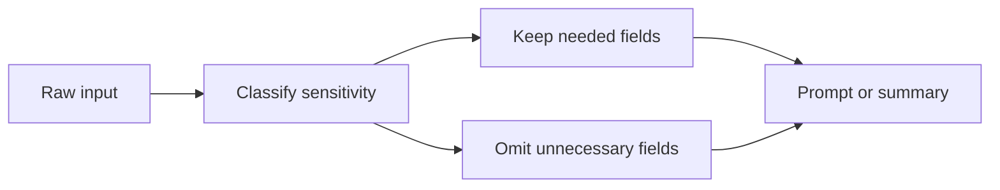

# Maa Sharda AI Memory System

The memory system helps Maa Sharda AI remember what matters without storing unnecessary personal data.

The design favors reliability, low read cost, and privacy. Memory should improve continuity, not create surveillance.

## Memory Goals

- Remember customer preferences
- Remember conversation summaries
- Remember relationship history
- Remember business preferences
- Remember owner preferences
- Remember important events
- Avoid storing unnecessary personal data

## Memory Principles

1. Store only what helps the business act better next time.
2. Prefer summaries over raw history.
3. Prefer confirmed facts over inferred facts.
4. Keep memory scoped by business and by customer.
5. Expire stale memory instead of preserving it forever.
6. Retrieve the smallest useful context.
7. Never let memory override a fresh user correction.
8. Do not store personal data that is not needed for service.

## Memory Layers

### Existing

- The app already stores customer records, billing state, and conversation history.

### Planned

- Add structured memory summaries at the customer, conversation, and business levels.

### Future

- Memory becomes a controlled relationship layer that supports more proactive AI behavior without expanding data retention unnecessarily.

## 1. Long-Term Memory

Long-term memory stores stable, useful information that is likely to matter in future interactions.

### What It Should Remember

- Customer preferences
- Relationship history
- Business preferences
- Owner preferences
- Important events
- Confirmed policy exceptions

### What It Should Not Remember

- Unnecessary personal details
- Raw transcripts when a summary is enough
- Sensitive information not required for service
- Temporary noise that will quickly become stale

### Existing

- Some long-term context already exists inside customer records and billing data.

### Planned

- Long-term memory should be represented as structured summary fields on existing documents, not as a separate memory dump.

### Future

- Long-term memory can become more predictive, but only within strict privacy and approval boundaries.

### Long-Term Memory Fields

- `customerPreferenceSummary`
- `relationshipSummary`
- `businessPolicySummary`
- `ownerPreferenceSummary`
- `importantEventSummary`
- `lastConfirmedAt`
- `sourceEventId`
- `confidence`

### Long-Term Memory Inputs

- Confirmed customer actions
- Approved owner decisions
- Repeated service patterns
- Billing outcomes
- Important support events

### Long-Term Memory Outputs

- Short reusable summary
- Preferences for future interactions
- Relationship notes for the AI

### Long-Term Memory Flow

## 2. Short-Term Memory

Short-term memory stores the immediate context needed to answer the current question safely.

It should be lightweight and transient.

### What It Should Remember

- The current conversation thread
- The last few turns
- The immediate task in progress
- The current approval state
- The current customer intent

### What It Should Not Remember

- Older details that are already summarized
- Data that is not relevant to the current exchange
- Sensitive information that is not needed to finish the task

### Existing

- Short-term context already exists in conversation history and recent app state.

### Planned

- The AI should build a compact working context from the last relevant turns and a few structured summaries.

### Future

- Short-term memory can become more task-aware, but it should remain bounded and automatically pruned.

### Short-Term Memory Inputs

- Recent messages
- Recent voice transcript
- Pending approval state
- Active customer context
- Current dashboard or task context

### Short-Term Memory Outputs

- Working context buffer
- Current task summary
- Next-step state

### Short-Term Memory Flow

## 3. Summaries

Summaries are the bridge between raw history and reusable memory.

They should compress long interaction history into a few lines that can be safely reused.

### Summary Types

- Conversation summary
- Customer relationship summary
- Business preference summary
- Owner preference summary
- Important event summary
- Billing summary

### Summary Rules

1. Keep summaries short.
2. Include only confirmed or strongly supported facts.
3. Separate facts from interpretation when possible.
4. Mention uncertainty instead of guessing.
5. Update summaries when the customer or owner corrects them.
6. Do not copy raw sensitive text into the summary unless required.

### Existing

- The app already keeps some state that can support summaries.

### Planned

- Generate summary fields after important events or after a conversation closes.

### Future

- Use summaries as the default retrieval surface for most AI requests.

### Summary Flow

## 4. Retrieval Strategy

Retrieval should minimize reads and minimize accidental context leakage.

The AI should retrieve in this order:

1. Current task context
2. Relevant customer summary
3. Relevant conversation summary
4. Relevant business or owner preference summary
5. Only then, a small slice of recent history if needed

### Retrieval Rules

- Retrieve only what the current task needs.
- Do not load full history by default.
- Prefer a single summary document over many document reads.
- If the AI is uncertain, retrieve less and ask a clarification question.
- Never retrieve unrelated customer data just because it exists.

### Existing

- The current app relies on direct customer, billing, and notification reads.

### Planned

- Retrieval becomes summary-first.

### Future

- Retrieval can become predictive, but the filter remains strict and scoped.

### Retrieval Flow

## 5. Context Window Optimization

Context windows should stay as small as possible while still being useful.

Optimization rules:

- Put stable facts into summaries
- Put volatile facts into the short-term buffer
- Use recency only when it changes the answer
- Prefer one high-signal summary over many raw records
- Trim repeated boilerplate
- Remove stale or contradicted details
- Do not include empty or low-value fields

### Context Layers

- System policy
- Business policy
- Current task
- Relevant summary memory
- Relevant recent exchange
- Necessary tool output

### Existing

- The product already stores enough state to support narrow context assembly.

### Planned

- The AI should assemble context dynamically from summaries and task-specific slices.

### Future

- The system may precompute task-specific context packs for common workflows.

### Context Optimization Flow

## 6. Memory Expiration

Memory should expire when it is no longer useful or no longer trustworthy.

### Expiration Rules

- Expire or demote memory when a customer corrects it.
- Expire temporary task memory after the task is complete.
- Expire stale event-derived summaries when contradicted by later events.
- Expire old conversation context after it has been summarized.
- Expire business preferences only when the owner changes them.

### Retention Tiers

- Short-term working context: minutes to hours
- Conversation summaries: until superseded or archived
- Customer relationship summaries: long-lived, but editable
- Business and owner preferences: long-lived, but explicitly updated
- Important events: long-lived when they affect service, billing, or policy

### Existing

- Data already persists in customer and billing records.

### Planned

- Add explicit stale markers and summary update timestamps.

### Future

- Expiration can be policy-driven and event-aware, but should remain conservative.

### Expiration Flow

## 7. Privacy Controls

Privacy controls should prevent the system from storing more personal data than it needs.

### Privacy Principles

1. Data minimization.
2. Purpose limitation.
3. Business-scoped access.
4. Avoid raw transcript retention when summaries are sufficient.
5. Exclude sensitive data from memory if it is not needed for service.
6. Store only what is needed to maintain the relationship and the bill.
7. Keep human-readable summaries free of unnecessary identifiers when possible.

### Data That Should Not Be Stored Unnecessarily

- Full raw voice transcripts beyond what is needed for service handling
- Sensitive personal details unrelated to service
- Redundant copies of the same preference or event
- Private notes that are not needed for the business to operate

### Access Controls

- Customers can see their own relevant summaries where appropriate.
- Owner and approved AI can read business-scoped memory.
- Server-side AI writes must be policy-checked.
- Raw history should be more restricted than summaries.

### Prompt Privacy Rules

- Do not pass irrelevant personal data into prompts.
- Do not pass raw transcripts when a summary will do.
- Mask or omit fields that are not needed for the task.
- Treat memory retrieval like a permissioned read, not a default read.

### Existing

- Privacy is already partially supported by scoped customer and billing records.

### Planned

- Add explicit summary fields and staleness handling so less raw data is needed.

### Future

- Introduce stronger retention policies and privacy reviews if the product expands.

### Privacy Control Flow

## Recommended Memory Storage Pattern

To avoid a separate memory collection, store memory in the documents that already need to be read:

- `customers.memorySummary` for customer preferences and relationship history
- `conversations.summary` and `conversations.memorySummary` for thread-level context
- `businesses/{businessId}` for business and owner preferences
- `billingPeriods.summary` for billing-related memory that affects understanding of dues

This keeps reads cheap and avoids creating an unnecessary memory silo.

## Success Metrics

- Customer does not need to repeat preferences often
- AI answers correctly from summaries without long history reads
- Stale memory gets corrected quickly
- Privacy-sensitive data is not retained unless needed
- Retrieval stays cheap enough for Firebase pricing

## Non Goals

- A general-purpose personal knowledge base
- A large transcript archive as the default memory model
- Automatic long-term storage of all raw messages
- Storing sensitive data just because it might be useful someday
