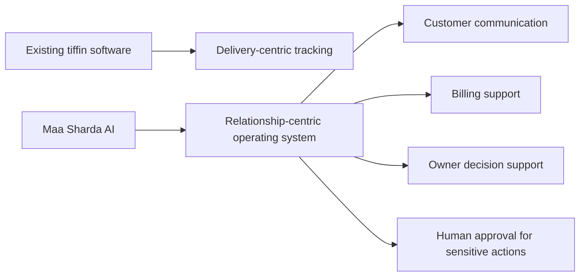
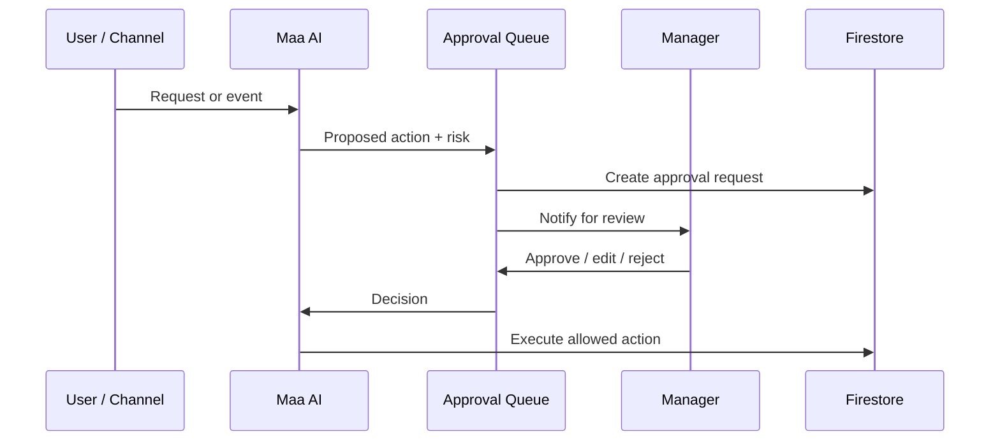
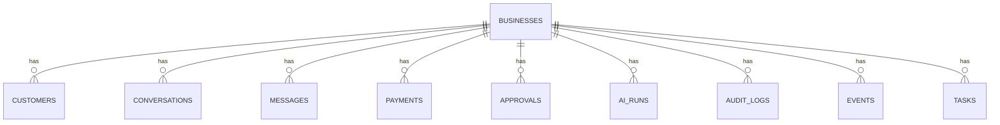
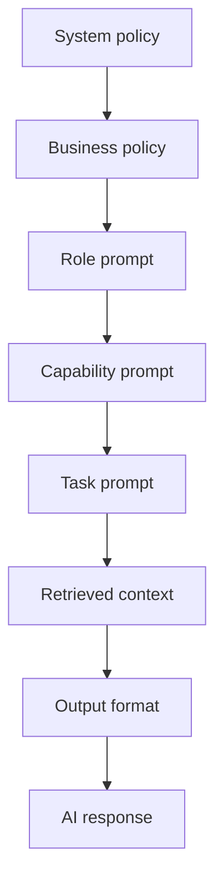

# Maa Sharda AI Vision

Maa Sharda AI is an AI Relationship Operating System for tiffin businesses.

This document freezes the product direction before more code is written. It separates what exists today from what is planned and what belongs to the future.

## Mission

Help tiffin businesses grow by making customer communication dependable, fast, and personal.

The business wins because relationships are maintained well: messages are answered, exceptions are handled, reminders are sent at the right time, and customers feel known. Delivery tracking is operationally useful, but it is not the product center.

## Problem Statement

Tiffin businesses run on high-frequency communication.

They must handle onboarding, meal preferences, pauses, payment follow-up, menu updates, disputes, reminders, and customer trust. Most software focuses on dispatch and status tracking, while the real daily burden is relationship work.

The result is:

- Too much manual follow-up
- Too much context kept in memory or chat threads
- Too much repetition for simple questions
- Too much dependency on the owner for every exception
- Too little system support for communication history, policy, and next actions

## Why Existing Tiffin Software Fails

Most existing tiffin software fails because it is built around delivery management, not relationship management.

It typically:

- Treats customers like rows in a ledger instead of ongoing relationships
- Assumes the main operational problem is route status
- Requires the owner to manually answer repetitive questions
- Handles billing and communication as separate workflows
- Stores data, but does not help decide what to say next
- Lacks context across messages, billing, pauses, and customer preferences
- Does not support approval workflows for sensitive actions

## Our Differentiation

Our differentiation is communication flexibility.

Maa Sharda AI should become the business relationship manager, not a delivery console.

That means:

- Customer communication is first-class
- The system remembers context across interactions
- The AI can draft, summarize, classify, and recommend
- The owner stays in control for sensitive actions
- The platform supports multiple channels, especially voice and messaging
- Billing, onboarding, and support are tied together through shared customer context

### Positioning Diagram

## Product Philosophy

1. Solve the communication problem before solving the automation problem.
2. Keep the owner in control of business-changing actions.
3. Make the default interaction natural, conversational, and low-friction.
4. Prefer structured memory over implicit memory.
5. Prefer narrow, safe actions over broad autonomous actions.
6. Design for small-business realities: low time, low tolerance for errors, and high trust requirements.

## AI Philosophy

AI should behave like a dependable assistant that understands context, not like a free-form autopilot.

Core rules:

- AI drafts first, acts second
- AI should explain what it is doing in human terms
- AI should ask when context is missing
- AI should use tools only when the action is permitted and traceable
- AI should optimize for correctness, tone, and trust over novelty
- AI should not invent business commitments, billing outcomes, or policy exceptions

## Human-in-the-Loop Philosophy

Human oversight is not a fallback. It is part of the operating model.

The manager approves sensitive changes because:

- Customer trust matters more than speed in edge cases
- Billing mistakes are costly
- Policy exceptions should be deliberate
- Business tone should remain consistent

Human approval is especially important for:

- Customer profile activation
- Billing adjustments
- Dues waivers
- Refund-like actions
- Policy exceptions
- Outbound messages that commit the business to something unusual

## User Personas

### 1. Business Owner

The owner wants fewer interruptions, clearer billing visibility, and better customer retention.

### 2. Customer

The customer wants simple onboarding, reliable communication, payment clarity, and a feeling that the business remembers them.

### 3. Operations Staff

If present, staff need a narrow interface for logging information, resolving issues, or relaying information to the owner.

### 4. AI System

The AI is a helper that drafts, sorts, summarizes, and recommends. It is not a substitute for ownership.

## User Roles

### Existing

- Manager
- Customer

### Planned

- AI Relationship Manager
- AI Manager / Owner Copilot
- AI Billing Assistant

### Future

- Voice-first onboarding assistant
- Specialized workflow copilots for support, retention, and collections

## Core Business Workflows

### 1. Customer onboarding

Existing:

- Customer data is created and managed manually

Planned:

- AI captures onboarding information through chat or voice
- AI drafts the customer record and confirms key details
- Manager approves activation when needed

Future:

- Voice-first onboarding becomes the default for new customer intake

### 2. Menu communication

Existing:

- Menu information is entered and shared manually

Planned:

- AI helps draft menu summaries and customer-facing updates

Future:

- AI adapts menu communication based on customer preferences and business tone

### 3. Payment follow-up

Existing:

- Owner checks payment status and manually follows up

Planned:

- AI Billing Assistant drafts reminders and summarizes dues
- Manager approves sensitive billing changes

Future:

- AI helps detect payment patterns and suggests follow-up timing

### 4. Customer support and exception handling

Existing:

- Owner responds manually in chat or calls

Planned:

- AI Relationship Manager drafts responses and routes exceptions

Future:

- AI handles low-risk requests end-to-end under policy

### 5. Owner oversight

Existing:

- Owner reviews operational status in the app

Planned:

- AI Manager summarizes trends and suggests actions

Future:

- AI becomes the business control surface for routine decisions

## AI Architecture

The AI system is designed as a production-first orchestration layer. It should optimize for correctness, traceability, and recoverability before autonomy.

The core operating rule is:

- Observe the event or request
- Load only the minimum context required
- Produce a draft or recommendation
- Check risk and permission
- Require approval when the action can affect the business, a customer, or money
- Log everything

### Maa AI

Purpose:
The umbrella orchestrator that routes work to the right AI capability, loads context, enforces policy, and coordinates tool usage.

Inputs:
- User messages and voice transcripts
- Firestore events
- Customer profile data
- Billing state
- Business policy and tone settings
- Pending approvals
- Prior AI run summaries

Outputs:
- Classified intent
- Selected capability
- Draft response or action plan
- Risk score
- Tool call plan
- Approval request when needed
- Audit record

Prompt:
- System policy prompt
- Business policy prompt
- Capability router prompt
- Minimum context summary
- Output schema prompt

Tools:
- Read context
- Create draft
- Classify risk
- Create approval request
- Write audit log

Risk:
- Router mistakes can send work to the wrong capability
- Prompt injection can redirect tool usage
- Overly broad context can leak private data

Approval Requirement:
- Yes for any action that changes customer data, billing data, or external communication
- No for read-only classification and summarization

Failure Handling:
- Fall back to a human-readable clarification request when intent is ambiguous
- Retry classification with narrower context
- Never execute a tool call if routing confidence is low

Success Metrics:
- Correct routing rate
- Approval precision
- Low tool error rate
- Minimal policy violations
- Fast time to first safe response

### Customer AI

Purpose:
Manage customer-facing communication, answer routine questions, draft replies, and maintain relationship continuity.

Inputs:
- Customer identity
- Conversation history
- Menu and plan context
- Billing summary
- Service policies
- Channel metadata
- Customer preference memory

Outputs:
- Draft reply
- Short summary for the owner when escalation is needed
- Intent label
- Suggested next action

Prompt:
- Customer communication style prompt
- Allowed topic boundaries
- Retrieved customer memory
- Recent conversation window
- Response formatting rules

Tools:
- Fetch customer record
- Fetch conversation history
- Fetch payment status
- Fetch menu context
- Draft outbound message
- Escalate to owner
- Record conversation note

Risk:
- Wrong-person replies
- Overconfident commitments
- Leakage of billing or personal information
- Prompt injection through malicious customer text

Approval Requirement:
- Required for promises, exceptions, billing changes, account changes, and any externally visible action beyond routine information sharing
- Not required for low-risk informational drafts that are not automatically sent

Failure Handling:
- Ask for clarification if identity is uncertain
- Escalate to owner if context is incomplete or the request is sensitive
- If a reply cannot be drafted safely, return a short apology and handoff note

Success Metrics:
- First-response time
- Escalation accuracy
- Customer satisfaction with tone and correctness
- Reduction in owner manual replies

### Owner Copilot

Purpose:
Help the owner understand what is happening across customers, payments, menu operations, and approvals without replacing judgment.

Inputs:
- Business-level summaries
- Customer statuses
- Open approvals
- Exception queue
- Billing aggregates
- Recent events
- AI run summaries

Outputs:
- Situation brief
- Trend summary
- Exception list
- Suggested action
- Operational warning

Prompt:
- Owner-specific briefing prompt
- Business policy prompt
- Summary templates
- Risk boundaries for recommendations

Tools:
- Aggregate business data
- Read customer and billing records
- Read event history
- Create internal task
- Create approval request

Risk:
- False confidence in summaries
- Missed exception context
- Recommendations that sound authoritative but are incomplete

Approval Requirement:
- Required if the copilot proposes a write, a customer-facing action, or a billing adjustment
- Not required for internal summaries and read-only analysis

Failure Handling:
- If data is stale, state that explicitly
- If conflicting records exist, return the conflict instead of choosing silently
- If the model cannot summarize safely, return a structured data snapshot instead

Success Metrics:
- Owner time saved
- Summary accuracy
- Reduction in manual record checking
- Number of useful recommendations accepted by the owner

### Billing Assistant

Purpose:
Handle dues visibility, reminders, reconciliation support, and billing explanation while protecting ledger integrity.

Inputs:
- Monthly billing records
- Customer rate
- Payment history
- Reminder history
- Dispute notes
- Manual adjustments
- Month key

Outputs:
- Due summary
- Reminder draft
- Reconciliation suggestion
- Discrepancy alert
- Exception note

Prompt:
- Billing policy prompt
- Calculation constraints prompt
- Reminder tone prompt
- No-assumption ledger prompt

Tools:
- Read payment ledger
- Read customer rate
- Draft reminder
- Create billing exception request
- Write reconciliation proposal
- Write audit log

Risk:
- Incorrect totals
- Duplicate confirmation
- Unapproved waivers
- Confusing partial-payment language

Approval Requirement:
- Yes for payment confirmation, waivers, refunds, corrections, and any ledger write that changes financial truth
- No for read-only due summaries and draft reminders that are not sent automatically

Failure Handling:
- Stop on inconsistent ledger state and flag for review
- Never infer a confirmed payment from a customer message alone
- If reminder content is risky, route it to approval instead of sending

Success Metrics:
- Ledger accuracy
- Number of billing exceptions correctly flagged
- Reminder delivery success
- Reduction in manual billing lookups

### Memory

Purpose:
Preserve customer and business context in a structured way so the AI can remain consistent without rereading full history every time.

Inputs:
- Customer messages
- Owner decisions
- Billing events
- Onboarding details
- Approval outcomes
- Stable business preferences

Outputs:
- Short memory entries
- Customer preference summary
- Business policy memory
- Conversation summary
- Confidence score for reuse

Prompt:
- Memory write prompt
- Memory retrieval prompt
- Compression rules prompt
- Privacy filtering prompt

Tools:
- Read conversation history
- Summarize session
- Write memory entry
- Update memory entry
- Mark memory stale

Risk:
- Storing inaccurate summaries
- Reusing stale memory
- Accidentally retaining unnecessary sensitive data

Approval Requirement:
- No for internal memory compression
- Yes if a memory write changes externally visible customer or billing state

Failure Handling:
- If memory is uncertain, keep it out of the prompt
- Prefer no memory over wrong memory
- Expire stale entries when contradicted by new events

Success Metrics:
- Memory reuse accuracy
- Reduction in repeated questions
- Low stale-memory rate
- Low privacy leakage rate

### Approval Queue

Purpose:
Hold risky AI-proposed actions until a human approves, edits, or rejects them.

Inputs:
- Proposed action
- Risk score
- Tool plan
- Relevant context
- Business policy

Outputs:
- Pending approval item
- Approval decision
- Updated action payload
- Rejection reason

Prompt:
- Approval summary prompt
- Plain-language change summary prompt
- Risk explanation prompt

Tools:
- Create approval document
- Update approval status
- Notify manager
- Execute approved action
- Write audit log

Risk:
- Approval fatigue
- Queue backlog
- Misleading summaries that make risky actions seem safe

Approval Requirement:
- This subsystem exists specifically for approval-gated actions

Failure Handling:
- Keep requests pending on failure
- Retry notification delivery
- Never auto-approve after timeout

Success Metrics:
- Approval turnaround time
- Rejection rate for unsafe actions
- Zero unreviewed high-risk writes

### Event System

Purpose:
Make the AI architecture event-driven so actions are observable, replayable, and easier to recover.

Inputs:
- Firestore writes
- Channel messages
- Approval changes
- Billing updates
- Onboarding completions

Outputs:
- Durable domain events
- Event subscribers
- AI run triggers
- Follow-up tasks

Prompt:
- Event classification prompt
- Event-to-capability mapping prompt
- Replay safety prompt

Tools:
- Write event
- Read event stream
- Mark event processed
- Replay event

Risk:
- Duplicate processing
- Event loops
- Missing correlation

Approval Requirement:
- No for event creation
- Yes if an event causes a high-risk write

Failure Handling:
- Use idempotent processors
- Store processing state
- Retry safely with correlation IDs

Success Metrics:
- Event processing success rate
- Duplicate suppression rate
- Mean time to recover failed processing

### Prompt Management

Purpose:
Keep prompts versioned, testable, and traceable.

Inputs:
- Business policy
- Role definition
- Capability definition
- Tool allowlist
- Output schema

Outputs:
- Versioned prompts
- Prompt metadata
- Change history
- A/B comparison data

Prompt:
- System prompt
- Capability prompt
- Response format prompt
- Safety constraints prompt

Tools:
- Read prompt version
- Write prompt version
- Compare prompt output
- Record prompt usage

Risk:
- Unreviewed prompt drift
- Hidden behavior changes
- Prompt sprawl

Approval Requirement:
- Yes for production prompt changes that affect external behavior

Failure Handling:
- Roll back to the last known good version
- Pin critical flows to approved prompt versions

Success Metrics:
- Prompt stability
- Regression rate after prompt changes
- Traceability of responses to prompt versions

### Tool Calling

Purpose:
Give AI controlled access to data and actions without exposing unrestricted system access.

Inputs:
- Structured AI action request
- Allowed tool list
- Approval state
- Risk score

Outputs:
- Tool result
- Tool error
- Execution trace

Prompt:
- Tool selection prompt
- JSON action schema prompt
- Safety and retry prompt

Tools:
- Read tools
- Write tools
- Notification tools
- Approval tools
- Audit tools

Risk:
- Unauthorized writes
- Tool misuse
- Incorrect parameters
- Over-broad permissions

Approval Requirement:
- Yes for any tool that changes customer data, billing data, or external messages

Failure Handling:
- Validate before execution
- Reject malformed tool arguments
- Retry only idempotent operations

Success Metrics:
- Tool execution success rate
- Tool validation failure rate
- Unauthorized action rate

### Audit Logs

Purpose:
Provide a complete trace of AI behavior for trust, debugging, and review.

Inputs:
- User request
- AI decision
- Prompt version
- Tool calls
- Approval decisions
- Final result

Outputs:
- Append-only audit record
- Correlation trail
- Review history

Prompt:
- Audit summarization prompt for human review

Tools:
- Write audit record
- Read audit history
- Search audit trail

Risk:
- Incomplete logging
- Over-logging sensitive data
- Logs becoming unusable if not structured

Approval Requirement:
- No for writing logs
- Yes if an audit review reveals a corrective business action

Failure Handling:
- Never block the core action solely because audit logging failed, but mark the run as incomplete and alert the owner
- Retry log persistence until durable storage is confirmed

Success Metrics:
- Coverage of AI actions in logs
- Audit completeness
- Time to trace an incident

## Permission Model

### Existing

- Manager can operate the business app
- Customer can view own data

### Planned

- Maa AI can orchestrate low-risk work
- Customer AI can draft customer communication
- Owner Copilot can summarize and recommend
- Billing Assistant can draft billing work but not finalize sensitive financial changes without approval

### Future

- Fine-grained policy scopes by action type, channel, and risk tier
- Channel-based permissions for voice, WhatsApp, and internal review

Permission principles:

- Least privilege
- Business isolation
- Explicit approval for sensitive writes
- Human ownership of externally visible commitments

## AI Approval Workflow

### Existing

- Manual owner action

### Planned

- AI produces a proposed action
- The system classifies the action by risk
- Medium and high-risk actions create approval requests
- Manager approves, edits, or rejects
- The system executes the approved version and records the result

### Future

- Policy-driven auto-approval for narrowly defined safe actions

## Firestore Schema Changes

The current data model is oriented around customers, orders, payments, and settings. The future model should add AI-native objects without losing the existing business data.

### Existing

- customers
- orders
- payments
- menu
- config/settings
- notifications

### Planned

- conversations
- messages
- approvals
- aiRuns
- auditLogs
- events
- tasks

### Future

- summaries
- knowledge references
- voiceSessions

Recommended schema direction:

## New Collections

Recommended new collections are:

- conversations
- messages
- approvals
- aiRuns
- auditLogs
- events
- tasks
- voiceSessions

Use only the collections that are required for the first AI workflows. Do not add collections just because they are available.

## Prompt Architecture

Prompts should be layered and versioned.

Layers:

- System policy prompt
- Business policy prompt
- Role prompt
- Capability prompt
- Task prompt
- Retrieved context prompt
- Output format prompt

Principles:

- Keep prompts narrow
- Separate classification from generation
- Version prompts alongside product changes
- Store the prompt version used for each AI run
- Retrieve only the minimum necessary context
- Treat prompt updates like production changes

### Prompt Stack Diagram

## Tool-Calling Architecture

Tool calls should be explicit, whitelisted, and policy-checked.

Rules:

- No unrestricted database access
- No direct writes without policy validation
- No tool execution without correlation IDs
- No sensitive action without approval state
- Every call must be logged
- Every tool result must be safe to summarize back into the model context

Tool groups:

- Read tools
- Draft tools
- Write tools
- Approval tools
- Channel tools
- Audit tools

## Failure Handling

The system should fail safely and visibly.

### Existing

- User actions are mostly manual, so failure is primarily operational

### Planned

- Retry transient tool failures
- Fall back to human review when context is incomplete
- Keep approval requests pending on failure rather than dropping them
- Record every failed AI run and tool call
- Use safe defaults instead of guessing

### Future

- Resilient event replay
- Partial recovery for interrupted workflows
- Automatic escalation for repeated failures

Failure principles:

- Never silently apply a risky fallback
- Never lose a customer-visible commitment
- Never hide an approval failure
- Prefer a short explicit failure over a wrong answer

## Audit Logs

Audit logs are required for trust and debugging.

They should capture:

- Who requested the action
- What AI capability was used
- Which prompt version ran
- Which tools were called
- Which approval path was taken
- What changed
- What failed
- What it cost
- Which event or correlation ID linked the run

Audit logs should be immutable or treated as append-only.

## Cost Optimization

The product must stay economical for small businesses.

Approach:

- Use small models for routing and classification
- Use larger models only for the hardest drafting tasks
- Cache stable context
- Summarize old conversations
- Retrieve narrowly
- Batch background work
- Minimize unnecessary tool calls
- Avoid repeated reprocessing of unchanged events

## Security Considerations

Security must protect customer trust and business data.

Requirements:

- Tenant isolation
- Role-based access control
- Approval gates for sensitive actions
- Prompt injection resistance
- PII minimization
- Secure handling of phone numbers and billing data
- Secret isolation from prompts
- Auditability of every AI action
- Tool allowlists with explicit scope boundaries
- Idempotent write patterns for sensitive actions

## MVP Scope

### Existing

- Manager and customer portals
- Customer records
- Billing records
- Menu sharing
- Manual owner communication

### Planned

- AI Relationship Manager for drafting and triage
- AI Manager for summaries and recommendations
- AI Billing Assistant for reminders and dues support
- Approval workflow for sensitive actions
- Event log and audit log foundation

### Future

- Voice-first onboarding
- Deeper customer relationship memory
- Multi-step autonomous workflows under policy
- Expanded business insights and proactive support

## Future Vision

Maa Sharda AI should evolve into the operating system for the business relationship layer of tiffin businesses.

The end state is not delivery automation. The end state is a system that:

- Knows the customer
- Remembers what matters
- Speaks in the business’s tone
- Helps the owner respond quickly
- Keeps billing and communication aligned
- Uses AI responsibly with human oversight

## Product Principles

1. Relationship first, logistics second.
2. Communication is the core product.
3. Draft before act.
4. Human approval for sensitive changes.
5. Make the system remember what the business needs to remember.
6. Prefer simple, explainable automation.
7. Build for trust before scale.
8. Do not invent features beyond the frozen scope.
9. Keep existing, planned, and future capabilities clearly separated.
10. Optimize for small-business reality, not enterprise complexity.
