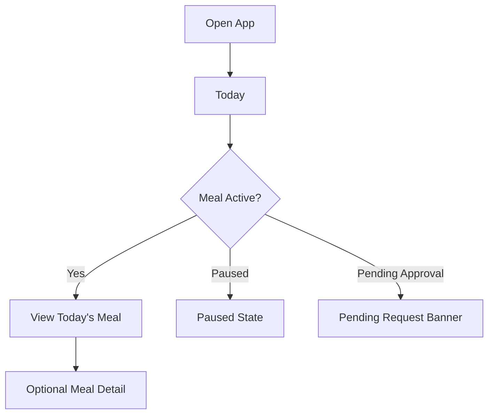
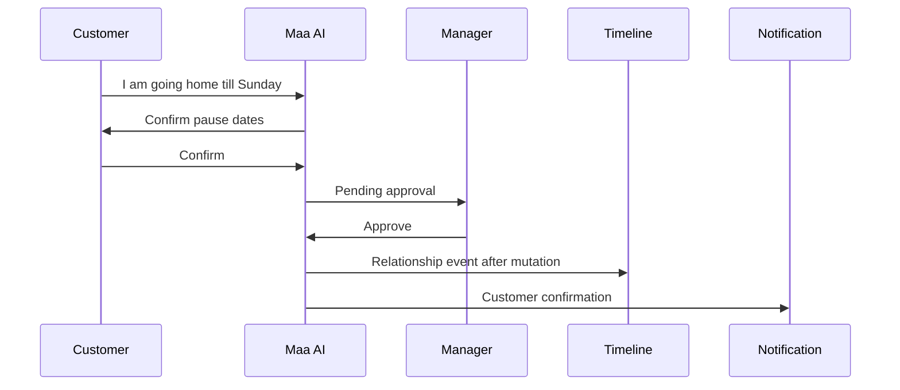
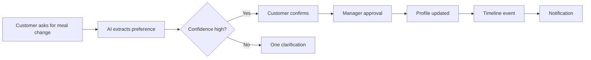
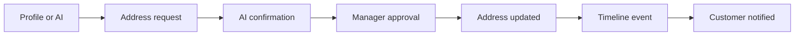
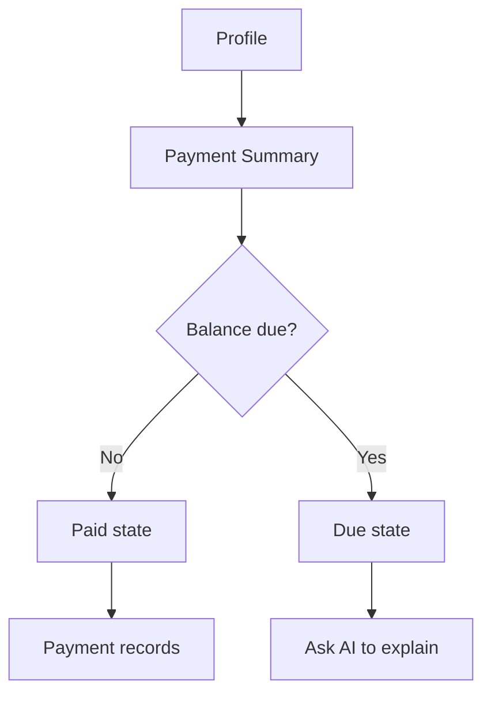
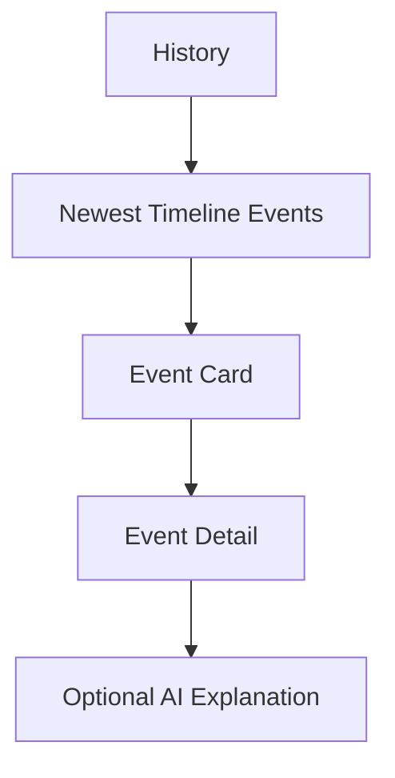

# Customer Experience

## Purpose

This document defines the Version 2 customer experience. It is a mobile-first product specification only.

## Current Implementation

The current customer portal provides:

- Home meal status
- Menu visibility
- Maa AI chat
- Payment details
- Timeline history
- Notifications
- Profile and subscription information

The redesign keeps all capabilities but reorganizes them into a premium four-tab experience.

## Proposed Redesign

Customer bottom navigation:

1. Today
2. AI
3. History
4. Profile

The customer home screen disappears. Today is the landing screen.

There is no Home tab in Phase 3.

## Customer Experience Principle

The customer should feel:

- Recognized
- Calm
- In control
- Confident that requests are being handled
- Free from operational clutter

Every customer screen should answer one question.

## Screen Inventory

### Today

Primary question: "What is happening with my meal today?"

Purpose:

- Show today's meal status.
- Show whether delivery is active, paused, resumed, or awaiting approval.
- Provide the safest entry point for common meal actions.

Inputs:

- Customer profile
- Today's order state
- Pause/resume state
- Meal preference
- Pending approvals
- Latest notification summary

Outputs:

- Open quick request sheet
- Open AI with prefilled intent context
- Open notification list
- Open meal detail

Content order:

1. Greeting, such as "Good Evening 👋"
2. Today's Meal
3. Daily Tiffin Reveal
4. Meal items
5. ETA
6. Delivery Partner
7. Pause Meal
8. Pending request banner, if any

Signature behavior:

- The tiffin reveal plays only on first open of the day, after pull-to-refresh, or after the meal changes.
- Otherwise the tiffin remains open.

### Meal Detail

Primary question: "What exactly is included in today's meal?"

Purpose:

- Expand the meal card without crowding Today.

Inputs:

- Today's meal
- Customer preference
- Delivery state

Outputs:

- Request meal change
- Ask AI about the meal

### Quick Request Sheet

Primary question: "What change do you want to request?"

Purpose:

- Start pause, resume, meal change, or address change.
- Route natural-language requests to AI confirmation.

Inputs:

- Selected action
- Customer-entered details
- Current profile state

Outputs:

- AI confirmation
- Clarification question
- Pending approval

### AI

Primary question: "What do you need Maa Sharda to help with?"

Purpose:

- Let customers express requests naturally.
- Show AI extraction, confirmation, and approval state.
- Feel familiar like WhatsApp, not like a form.

Inputs:

- Customer message
- Supported intent list
- Customer profile
- Pending approval state

Outputs:

- Clarification question
- Confirmation request
- Pending approval
- Unsupported request response
- Customer-facing explanation

Default suggestions:

- "I'll be home late."
- "Pause tomorrow."
- "Can I get extra chapati?"

### AI Confirmation

Primary question: "Is this request correct?"

Purpose:

- Make the customer explicitly confirm extracted details before manager approval.

Inputs:

- Extracted intent
- Effective date
- Requested value
- Reason
- Confidence

Outputs:

- Create pending approval
- Return to AI editing state

### Pending Approval

Primary question: "What is the status of my request?"

Purpose:

- Reassure the customer after a request is submitted.

Inputs:

- Approval status
- Submitted details
- Expected manager decision path

Outputs:

- Wait state
- Notification when approved or rejected

### History

Primary question: "What has happened in my relationship with Maa Sharda?"

Purpose:

- Display relationship timeline newest first.
- Show relationship history, not audit logs.

Inputs:

- Timeline events

Outputs:

- Timeline event detail
- Ask AI about a timeline event

### Timeline Event Detail

Primary question: "What does this event mean?"

Purpose:

- Explain one timeline event in customer language.

Inputs:

- Timeline event
- Metadata safe for customer display

Outputs:

- Ask AI for explanation
- Navigate to related Profile section if relevant

### Profile

Primary question: "What are my subscription details?"

Purpose:

- Show stable customer identity, subscription, address, food preference, and payment summary.
- Stay simple and avoid dashboard-like controls.

Inputs:

- Customer profile
- Subscription status
- Payment summary
- Address
- Meal preference

Outputs:

- Request address change
- Request meal change
- View payment detail
- Logout

Phase 3 sections:

- Subscription
- Address
- Phone
- Family Members (future)
- Settings

### Payment Summary

Primary question: "Where do I stand on payments?"

Purpose:

- Show current month payment status without turning the customer app into an accounting dashboard.

Inputs:

- Current month bill
- Total paid
- Remaining amount
- Payment records

Outputs:

- Ask AI to explain payment
- View payment records

### Notifications

Primary question: "What changed since I last checked?"

Purpose:

- Show customer-visible messages from approvals, payments, and service changes.

Inputs:

- Notification messages

Outputs:

- Open related request or timeline event
- Mark viewed

## Customer Flows

### Daily Meal Flow

### Pause Flow

### Meal Change Flow

### Address Change Flow

### Billing Flow

### Timeline Flow

## AI Placement

AI appears:

- In the AI tab.
- In Today quick requests.
- In Profile change requests.
- In payment explanation.
- In timeline event explanation.
- In pending approval status language.

AI does not appear:

- As an autonomous action button.
- Inside authentication.
- As a replacement for manager approval.
- As a generic decoration on every card.
- In places where a normal button is clearer.

## Empty States

- Today: "No meal is scheduled today" with one action to ask AI.
- AI: start with suggested request prompts for supported intents.
- History: "Your relationship history will appear here after updates."
- Profile: show loading skeleton until profile is ready.
- Notifications: "No new updates."

## Future Ideas

- AI relationship summary on History.
- Subscription health card on Profile.
- Saved meal preference notes.
- Payment explanation generated from billing records.
