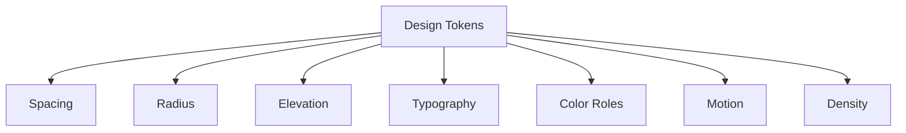

# Design System

## Purpose

This document defines design tokens and system-level rules for Maa Sharda Version 2. It is not CSS and does not implement components.

## Current Implementation

The current product uses working visual styles directly in application code. Version 2 should first define a design system so implementation can be consistent and premium.

## Proposed Design Direction

Customer UI:

- Premium
- Calm
- Spacious
- Personal
- Softly layered
- Low cognitive load

Manager UI:

- Dense
- Sectional
- Operational
- Fast to scan
- Clear status contrast

The two experiences may share tokens, but they should not share layout patterns blindly.

## Token Categories

## Phase 3 Token Source

Concrete Phase 3 token values live in `DESIGN_TOKENS.md`.

This document remains the system-level rulebook. `DESIGN_TOKENS.md` is the implementation-facing token contract for the hackathon premium UX build.

## Spacing Tokens

Use an 8-point spacing rhythm with smaller supporting increments.

| Token | Value | Use |
| --- | --- | --- |
| space-0 | 0 | No spacing |
| space-1 | 4 | Tight inline gaps |
| space-2 | 8 | Small component gaps |
| space-3 | 12 | Compact card padding |
| space-4 | 16 | Default screen padding |
| space-5 | 20 | Section separation |
| space-6 | 24 | Large card padding |
| space-8 | 32 | Major section separation |
| space-10 | 40 | Screen-level breathing room |

Rules:

- Customer screens use more vertical breathing room.
- Manager screens use tighter spacing but must remain touch-friendly.
- Do not rely on viewport-scaled spacing for core controls.

## Radius Tokens

| Token | Value | Use |
| --- | --- | --- |
| radius-0 | 0 | Flush surfaces |
| radius-1 | 4 | Small chips and indicators |
| radius-2 | 8 | Standard cards and fields |
| radius-3 | 12 | Premium cards and sheets |
| radius-4 | 16 | Large hero meal card |
| radius-full | Full | Pills and circular icon buttons |

Rules:

- Cards default to 8 radius unless a premium customer surface needs 12 or 16.
- Manager operational cards should stay compact and disciplined.

## Elevation Tokens

| Token | Use |
| --- | --- |
| elevation-0 | Flat page surface |
| elevation-1 | Standard card separation |
| elevation-2 | Sticky bottom navigation |
| elevation-3 | Bottom sheet or modal |
| elevation-4 | Critical overlay |

Rules:

- Elevation should communicate hierarchy, not decoration.
- Avoid stacking cards inside cards.
- Avoid decorative background blobs or gradient ornaments.

## Typography Tokens

| Role | Use |
| --- | --- |
| display | Customer Today hero state only |
| title-lg | Primary screen title |
| title-md | Section title |
| title-sm | Card title |
| body | Standard readable text |
| body-sm | Secondary descriptions |
| label | Form labels and compact metadata |
| caption | Dates, helper text, minor status |
| numeric | Payment amounts and counts |

Rules:

- Do not scale font size with viewport width.
- Letter spacing should remain normal except tiny uppercase labels when necessary.
- Customer copy should be human and reassuring.
- Manager copy should be direct and operational.

## Color Roles

Use semantic roles, not feature-specific colors.

| Role | Use |
| --- | --- |
| background | App base |
| surface | Cards and sheets |
| surface-raised | Elevated cards |
| text-primary | Main content |
| text-secondary | Supporting content |
| text-muted | Metadata |
| accent | Primary brand actions |
| accent-soft | Soft selected or highlighted state |
| success | Approved, paid, active |
| warning | Pending, due, needs attention |
| danger | Rejected, destructive, error |
| info | Neutral system information |
| border | Dividers and card boundaries |
| focus | Keyboard and accessibility focus |

Rules:

- Avoid a one-note palette.
- Customer palette should feel premium and food-adjacent without becoming beige-heavy.
- Manager palette should prioritize status clarity over mood.
- Do not encode status with color alone.

## Motion Tokens

| Token | Duration | Use |
| --- | --- | --- |
| motion-instant | 0 ms | State changes with no animation |
| motion-fast | 120 ms | Button press, small reveal |
| motion-standard | 180 ms | Sheet open, card expand |
| motion-slow | 240 ms | Full-screen transition |

Easing roles:

- ease-standard: routine movement
- ease-out: entering screen or sheet
- ease-in: leaving screen or sheet

Rules:

- Motion should clarify hierarchy.
- Avoid decorative animation.
- Respect reduced motion preferences.

## Density Tokens

Customer:

- Comfortable density.
- Fewer items per screen.
- More explanatory copy.

Manager:

- Operational density.
- More items per screen.
- Clear grouping and section headers.

## Iconography

Rules:

- Use familiar icons for navigation and utility actions.
- Icons must support text labels in bottom navigation.
- Approval decisions require text labels alongside icons.
- Do not use icons as decoration when they do not communicate action or state.

## Future Ideas

- Brand color palette calibration after visual exploration.
- Illustration style for empty customer states.
- Motion prototype for approval and pending states.
