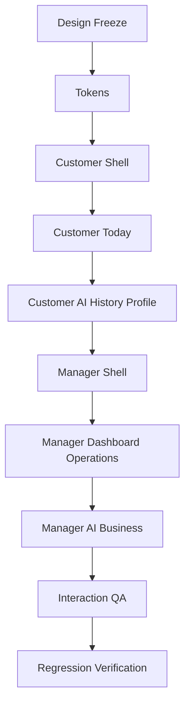

# UI Implementation Plan

## Purpose

This document sequences future UI implementation after Product Design Sprint 1. It does not implement UI.

## Current Implementation

The current app is production alpha with stable backend capabilities and working customer/manager portals.

## Proposed Implementation Strategy

Implement Version 2 in low-risk phases. Preserve backend behavior. Avoid changing authentication, Firestore architecture, billing calculations, Maa AI extraction, and approval logic.

## Phase 3 Hackathon Build

The current hackathon priority is Premium UX. Backend work should pause unless a frontend flow is blocked by an existing contract.

Detailed sprint scope lives in `PHASE_3_PREMIUM_UX.md`.

Immediate build order:

1. Finalize visual language and motion documentation.
2. Migrate customer navigation to Today, AI, History, Profile.
3. Ship the Daily Tiffin Reveal as the signature interaction.
4. Reorganize owner navigation around Dashboard, Operations, AI, Business, Settings.
5. Polish performance, screenshots, README, demo script, and seed data.

## Phase 0: Design Freeze

Goal:

- Confirm this documentation as the UI contract.

Deliverables:

- Product architecture approved
- Information architecture approved
- Navigation approved
- Component inventory approved
- Design tokens approved
- Interaction rules approved

Exit criteria:

- No open blocker on bottom navigation.
- Customer four-tab model accepted.
- Manager five-section model accepted.

## Phase 1: Design System Foundation

Goal:

- Establish tokens and reusable component specs before screen redesign.

Scope:

- Spacing
- Radius
- Elevation
- Typography roles
- Color roles
- Motion roles
- Accessibility rules

Risk:

- Visual inconsistency if implementation starts before tokens are agreed.

Exit criteria:

- Components can be built against stable token names.

## Phase 2: Customer Navigation Shell

Goal:

- Replace customer navigation architecture with Today, AI, History, Profile.

Scope:

- Bottom navigation
- Top-right notification bell
- Customer screen shell
- Routing hierarchy

Do not change:

- Customer login
- Customer data loading
- Maa AI backend flow

Exit criteria:

- Existing customer features remain accessible.
- Customer Home is replaced by Today.

## Phase 3: Customer Today

Goal:

- Create the premium landing experience.

Scope:

- Meal card
- Service state
- Subscription mini-card
- Pending approval banner
- Quick request entry

Exit criteria:

- Customer can understand today's meal state in one glance.
- Pause, resume, meal change, and address change remain accessible.

## Phase 4: Customer AI, History, Profile

Goal:

- Complete customer V2 experience.

Scope:

- AI request flow
- Confirmation states
- Pending approval states
- Timeline cards
- Profile and payment summary
- Notification list

Exit criteria:

- Timeline visible newest first.
- AI does not autonomously execute business actions.
- Billing summary remains accessible.

## Phase 5: Manager Navigation Shell

Goal:

- Introduce manager workflow navigation.

Scope:

- Dashboard
- Operations
- AI
- Business
- Settings

Do not change:

- Manager login
- Manager PIN behavior
- Approval callable behavior

Exit criteria:

- Current manager capabilities are reachable in the new IA.

## Phase 6: Manager Dashboard And Operations

Goal:

- Make daily work faster to scan.

Scope:

- Dashboard attention queue
- Today's orders
- Customers
- Customer detail
- Payments

Exit criteria:

- Manager can identify urgent work from Dashboard.
- Payment confirmation flow remains verified.

## Phase 7: Manager AI And Business

Goal:

- Rebuild decision workflows around AI approval clarity.

Scope:

- AI Inbox
- Approval Detail
- Onboarding Queue
- Billing
- Menu
- Reports Foundation

Exit criteria:

- Approval cards show current value, requested value, effective date, reason, and confidence.
- Onboarding approvals remain unchanged in business behavior.

## Phase 8: Interaction And Accessibility QA

Goal:

- Validate the complete V2 experience.

Checklist:

- Bottom navigation only
- Customer and manager navigation are different
- Every screen answers one question
- Loading states present
- Empty states present
- Error states present
- Offline states defined
- Success states clear
- Touch targets accessible
- Contrast accessible
- Font scaling safe

## Phase 9: Regression Verification

Goal:

- Prove UI redesign did not break product foundations.

Verification areas:

- Authentication
- Identity bridge
- Customer Today
- AI request flow
- Manager AI approval
- Onboarding approval
- Payment confirmation
- Timeline event display
- Notifications
- Billing foundation

Commands and test scripts should be chosen during implementation, not in this design sprint.

## Recommended Build Order

## Future Ideas

- Create visual prototypes after this documentation is approved.
- Build a UI migration checklist per screen.
- Add design QA screenshots after implementation starts.
- Create a design-system changelog once implementation begins.
