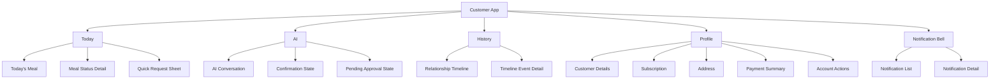

# Information Architecture

## Purpose

This document defines how Maa Sharda Version 2 organizes product capabilities for customers and managers. It is architecture only and does not prescribe UI implementation.

## Current Implementation

Current customer capabilities are available through a portal with tabs for home, menu, AI chat, payment, history, and alerts.

Current manager capabilities are available through dashboard, orders, customers, AI Inbox, payments, menu, and settings.

The current implementation proves the product surface. Version 2 reorganizes it into a cleaner mobile-first architecture.

## Proposed Redesign

Customer and manager information architecture must diverge. They serve different mental models:

- Customer: personal subscription status and requests.
- Manager: daily operations and approvals.

## Customer IA

Customer bottom navigation has exactly four items:

1. Today
2. AI
3. History
4. Profile

Notifications remain accessible through a bell in the top-right of customer screens. Notifications are not a bottom navigation item.

### Customer IA Rules

- Today is the landing screen.
- Today answers only: "What is happening with my meal today?"
- AI is for customer requests and explanations, not generic support pages.
- History is relationship memory, not audit history.
- Profile contains stable subscription and account facts.
- Billing details live under Profile, not as a primary tab.
- Notifications are accessed from the bell, not navigation.

## Manager IA

Manager bottom navigation should have five sections:

1. Dashboard
2. Operations
3. AI
4. Business
5. Settings

This is not a customer-style app shell. It is a workflow command center.

```mermaid
flowchart TB
  A[Manager App] --> B[Dashboard]
  A --> C[Operations]
  A --> D[AI]
  A --> E[Business]
  A --> F[Settings]

  B --> B1[Today Snapshot]
  B --> B2[Attention Queue]
  B --> B3[Business Pulse]

  C --> C1[Today's Orders]
  C --> C2[Customers]
  C --> C3[Customer Detail]
  C --> C4[Payments]
  C --> C5[Delivery Readiness]

  D --> D1[AI Inbox]
  D --> D2[Approval Detail]
  D --> D3[Onboarding Queue]
  D --> D4[AI Draft Detail]

  E --> E1[Billing]
  E --> E2[Menu]
  E --> E3[Reports Foundation]
  E --> E4[Business Profile]

  F --> F1[Manager PIN]
  F --> F2[Notification Settings]
  F --> F3[Customer Access Settings]
  F --> F4[System Health]
```

### Manager IA Rules

- Dashboard answers: "What needs attention now?"
- Operations answers: "What work needs doing today?"
- AI answers: "What decisions need human approval?"
- Business answers: "How is the business configured and performing?"
- Settings answers: "How do I control access and preferences?"

## Screen Inventory

Detailed screen purpose, inputs, and outputs live in:

- `CUSTOMER_EXPERIENCE.md`
- `MANAGER_EXPERIENCE.md`

This document owns hierarchy and routing.

## Capability Placement

| Capability | Customer Placement | Manager Placement |
| --- | --- | --- |
| Today's meal | Today | Operations -> Today's Orders |
| Customer profile | Profile | Operations -> Customer Detail |
| Subscription | Profile | Operations -> Customer Detail |
| Pause | Today quick request, AI | AI Approval Detail, Customer Detail |
| Resume | Today quick request, AI | AI Approval Detail, Customer Detail |
| Meal change | Today quick request, AI | AI Approval Detail, Customer Detail |
| Address change | Profile quick action, AI | AI Approval Detail, Customer Detail |
| Timeline | History | Customer Detail -> Relationship Timeline |
| Notifications | Bell | Dashboard attention, customer context |
| AI chat | AI | AI Inbox and contextual assists |
| Billing | Profile -> Payment Summary | Business -> Billing, Operations -> Payments |
| Manager approvals | Not applicable | AI |
| Onboarding | Customer entry flow | AI -> Onboarding Queue |
| Analytics foundation | Not visible as analytics | Business -> Reports Foundation |

## Current Implementation vs Proposed Redesign

| Area | Current Implementation | Proposed Redesign |
| --- | --- | --- |
| Customer landing | Home | Today |
| Customer navigation | More than four tabs | Four tabs maximum |
| Customer notifications | Tab and alerts area | Top-right bell |
| Manager navigation | Feature tabs | Workflow sections |
| AI | Customer chat plus manager inbox | Integrated into requests, approvals, context |
| History | Newly added timeline tab | Dedicated relationship memory surface |
| Billing | Payment tab | Profile summary for customer, Business/Operations for manager |

## Future Ideas

- AI-generated manager daily briefing in Dashboard.
- Customer "subscription health" summary in Profile.
- Business reports promoted after analytics foundation matures.
- Timeline search after relationship history becomes long enough to need it.

