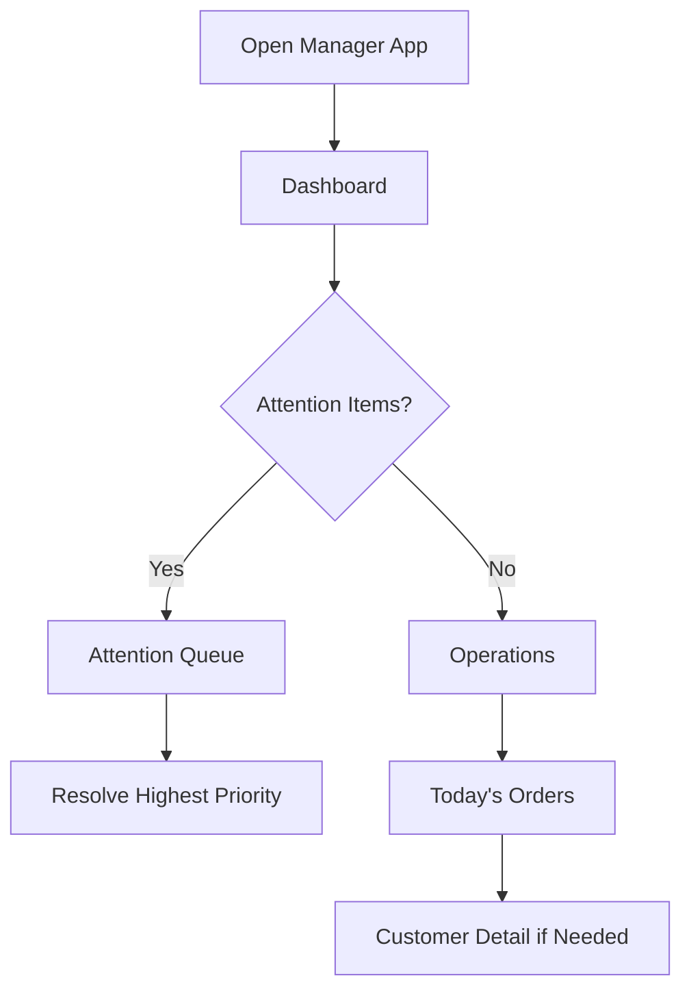
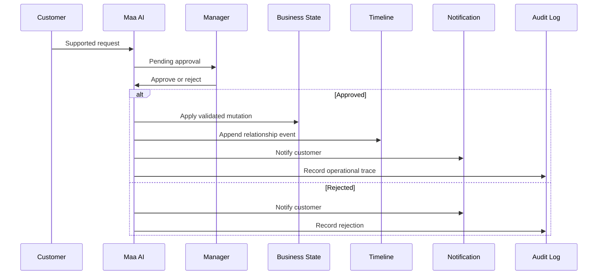
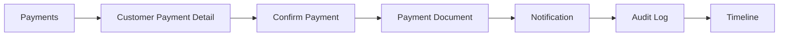
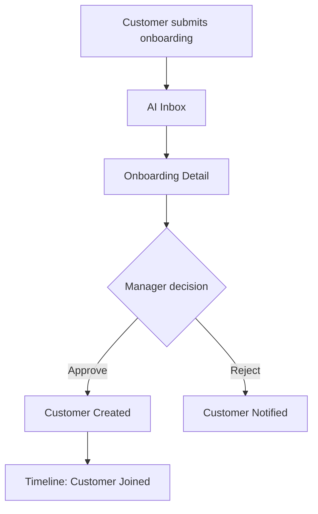

# Manager Experience

## Purpose

This document defines the Version 2 manager experience. It is workflow architecture only.

## Current Implementation

The current manager portal provides:

- Dashboard
- Orders
- Customers
- AI Inbox
- Payments
- Menu
- Settings
- Onboarding approvals
- AI action approvals

The redesign keeps all capabilities but reorganizes them into operational sections.

## Proposed Redesign

Manager bottom navigation:

1. Dashboard
2. Operations
3. AI
4. Business
5. Settings

This is a work console, not a premium customer subscription shell.

Phase 3 philosophy:

- Customer wants comfort.
- Owner wants speed.

## Manager Experience Principle

The manager should always know:

- What needs attention now.
- Which decisions are waiting.
- Which customers are affected.
- What changed after an action.

Each screen should answer one operational question.

## Screen Inventory

### Dashboard

Primary question: "What needs attention now?"

Purpose:

- Provide a daily command summary.
- Make revenue, deliveries, collections, and approvals scannable.

Inputs:

- Today's order count
- Paused customer count
- Pending AI approvals
- Pending onboarding approvals
- Payment due summary
- Recent notifications or exceptions

Outputs:

- Open Operations
- Open AI approvals
- Open Payments
- Open Customer Detail

Phase 3 quick actions:

- Resolve approvals
- Open today's route
- Confirm payments
- Update menu

### Attention Queue

Primary question: "What should I handle first?"

Purpose:

- Merge urgent operational items into one prioritized list.

Inputs:

- Pending approvals
- Failed or unclear requests
- Payment exceptions
- Service exceptions

Outputs:

- Open relevant detail screen

### Operations

Primary question: "What work needs doing today?"

Purpose:

- Group daily service execution.
- Put customers, orders, route, meals, and payments in one operational section.

Inputs:

- Today's orders
- Customer statuses
- Pause/resume state
- Delivery readiness

Outputs:

- Open Today's Orders
- Open Customers
- Open Customer Detail
- Open Payments

### Today's Orders

Primary question: "Who needs meals today?"

Purpose:

- Show active orders and exceptions.

Inputs:

- Orders
- Customer status
- Meal preference
- Pause/resume state

Outputs:

- Mark operational status
- Open customer
- Open AI context if a request caused an exception

### Customers

Primary question: "Which customer do I need?"

Purpose:

- Find and inspect customer records.

Inputs:

- Customer list
- Status
- Subscription
- Payment summary
- Search/filter criteria

Outputs:

- Open Customer Detail
- Start manual customer action if allowed by current product

### Customer Detail

Primary question: "What is the state of this customer?"

Purpose:

- Combine state, subscription, payments, and relationship history for one customer.

Inputs:

- Customer profile
- Orders
- Payments
- Pending approvals
- Timeline
- Notifications

Outputs:

- Open payment detail
- Open timeline event
- Open related approval
- Edit customer facts where current product allows manager edits

### Payments

Primary question: "Who has paid and who has not?"

Purpose:

- Manage current payment collection and confirmation.

Inputs:

- Current month billing
- Customer rates
- Payment records
- Remaining amounts

Outputs:

- Confirm payment
- Notify customer
- Write audit log
- Write timeline event

### AI Inbox

Primary question: "Which AI-decoded requests need my decision?"

Purpose:

- Review and resolve pending AI actions and onboarding approvals.

Inputs:

- Pending AI actions
- Onboarding approvals
- Customer context
- Extracted intent
- Confidence
- Current value
- Requested value
- Reason

Outputs:

- Approve
- Reject
- Add manager note
- Open customer context

### Approval Detail

Primary question: "Should I approve this request?"

Purpose:

- Show enough context to make one decision.

Inputs:

- Approval data
- Customer state
- Timeline summary
- AI extraction
- Risk notes

Outputs:

- Approve
- Reject
- Return to AI Inbox

### Onboarding Queue

Primary question: "Which new customer should be accepted?"

Purpose:

- Review submitted onboarding profiles.

Inputs:

- Onboarding session
- Submitted customer profile
- AI summary
- Manager note

Outputs:

- Approve onboarding
- Reject onboarding
- Open approved customer

### Business

Primary question: "How is the business set up and performing?"

Purpose:

- House slower business controls and reporting foundations.
- Keep reports, menu, pricing, delivery, and future analytics away from daily operations.

Inputs:

- Billing summaries
- Menu data
- Business configuration
- Analytics foundation

Outputs:

- Open Billing
- Open Menu
- Open Reports Foundation
- Open Business Profile

### Billing

Primary question: "What is the current billing state?"

Purpose:

- Show monthly billing foundation and payment collection state.

Inputs:

- Monthly bill documents
- Payment records
- Customer rates

Outputs:

- Open payment collection
- Open customer payment detail

### Menu

Primary question: "What meal information is visible to customers?"

Purpose:

- Manage existing menu visibility without expanding kitchen planning scope.

Inputs:

- Menu data

Outputs:

- Update customer-visible menu if current implementation supports it

### Reports Foundation

Primary question: "What business signal is available today?"

Purpose:

- Place existing analytics foundation without turning this sprint into analytics implementation.

Inputs:

- Existing stats
- Payment summaries
- Customer counts

Outputs:

- None beyond navigation to related detail screens

### Settings

Primary question: "How do I control access and system preferences?"

Purpose:

- Manage manager PIN, business settings, and system preferences.

Inputs:

- Manager auth state
- Settings
- Business links

Outputs:

- Update manager PIN
- Update supported business preferences
- Logout

## Manager Flows

### Daily Operations Flow

### AI Approval Flow

### Payment Confirmation Flow

### Onboarding Flow

## AI Placement

AI appears:

- Dashboard attention queue summaries.
- AI Inbox.
- Approval Detail.
- Onboarding Detail.
- Customer Detail as a compact relationship context summary.
- Payments only when explaining a customer-facing billing note.

AI does not appear:

- As a replacement for operational lists.
- In Settings, except for future help text.
- Inside authentication.
- As an automatic approval mechanism.
- In menu management unless a later sprint explicitly adds menu intelligence.

## Future Ideas

- AI daily briefing.
- Customer risk summary based on timeline.
- Suggested manager reply after approval.
- Batch approval grouping when volume grows.
- Reports promoted into a richer Business section.
