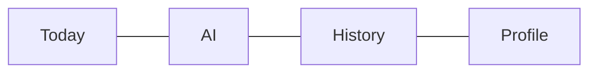
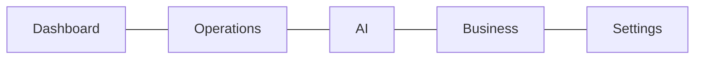
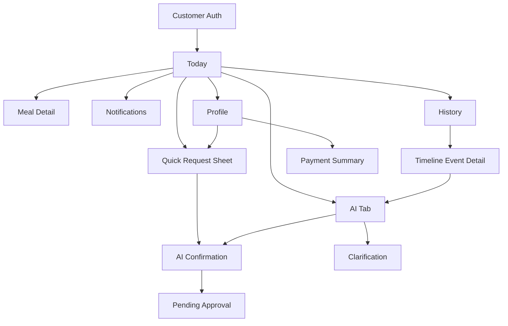
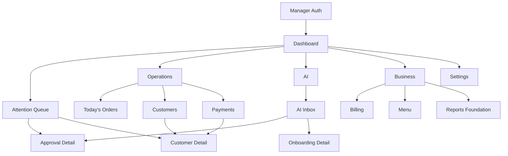

# Navigation Architecture

## Purpose

This document defines navigation rules for Maa Sharda Version 2. It is product architecture only.

## Current Implementation

Current customer and manager screens use tab-like navigation and feature groupings. The redesign keeps all capabilities but changes navigation hierarchy.

## Proposed Redesign

Bottom navigation is mandatory for both customer and manager experiences.

Top navigation and side navigation are not allowed. A top bar may exist only for:

- Screen title
- Back action
- Notification bell
- Contextual overflow action

The top bar is not navigation.

## Customer Navigation

Customer bottom navigation has exactly four items:

1. Today
2. AI
3. History
4. Profile

### Customer Navigation Rules

- App opens to Today.
- Notifications open from the top-right bell.
- Payment details are under Profile.
- Meal detail opens from Today.
- Timeline event detail opens from History.
- Change requests may start from Today, AI, or Profile, but route through the same AI confirmation pattern.
- Back returns to the parent tab, not to role selection.

## Manager Navigation

Manager bottom navigation has five items:

1. Dashboard
2. Operations
3. AI
4. Business
5. Settings

### Manager Navigation Rules

- App opens to Dashboard.
- Dashboard routes to work, not to feature pages.
- AI Inbox lives under AI.
- Orders, customers, and payments live under Operations.
- Billing, menu, reports foundation, and business profile live under Business.
- Access and preferences live under Settings.
- Customer Detail can be opened from Dashboard, Operations, AI, or Business, but it remains a detail screen, not a bottom tab.

## Navigation Maps

### Customer Map

### Manager Map

## Screen Depth Rules

- Primary tabs: bottom navigation only.
- Secondary screens: push from a parent tab.
- Temporary decisions: bottom sheet or modal sheet.
- Destructive or high-risk actions: confirmation sheet.
- Long forms: dedicated screen, not a cramped modal.
- Approval decisions: dedicated detail when context is needed; inline only when risk is low.

## Notification Navigation

Notifications are cross-cutting, but not a primary section.

Customer:

- Bell opens notification list.
- Notification opens related request, timeline event, or payment summary.

Manager:

- Urgent notifications appear as Dashboard attention items.
- Detailed notification records remain in customer context where relevant.

## Deep Link Rules

Future deep links should resolve to:

- Customer: Today, AI pending state, History event, Profile payment summary.
- Manager: Dashboard attention item, Approval Detail, Customer Detail, Payment Detail.

Deep links must not bypass authentication or manager approval.

## Future Ideas

- Role-aware deep links from notifications.
- Persistent "resume where you left off" after interrupted approval.
- AI-generated navigation suggestions in manager Dashboard.

