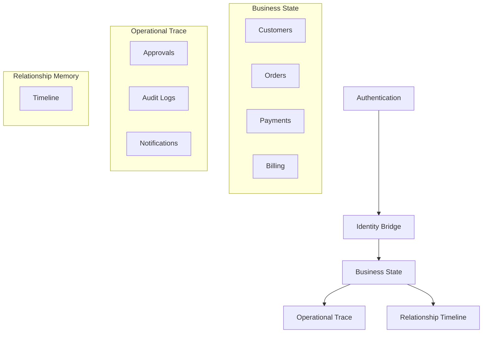
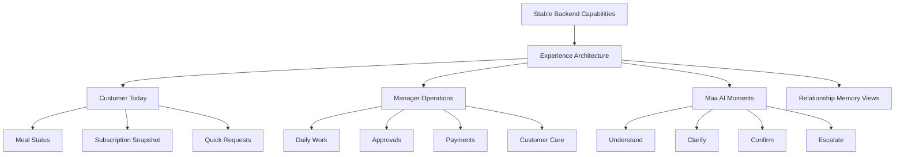

# Maa Sharda Product Architecture

## Purpose

This document defines the Version 2 product architecture for Maa Sharda. It is a design and product specification only. It does not propose backend changes, React changes, CSS changes, or implementation details.

Version 2 should make Maa Sharda feel like a premium mobile-first food subscription relationship product, not a CRUD tiffin tracker.

## Current Implementation

The production alpha already includes:

- Authentication
- Identity bridge
- Customer portal
- Manager portal
- Onboarding
- Manager AI Inbox
- Pause meals
- Resume meals
- Meal changes
- Address changes
- Customer relationship timeline
- Notifications
- Audit logs
- Billing foundation

These systems are treated as stable product capabilities. The redesign reorganizes access and interaction, not backend architecture.

## Proposed Redesign

Version 2 introduces a clearer product shape:

- Customer experience: premium, calm, mobile-first, subscription-oriented.
- Manager experience: operational, grouped by work, fast to scan.
- Maa AI: present at moments of interpretation, confirmation, approval, and explanation.
- Timeline: the visible customer relationship memory.
- Notifications: lightweight top-right attention, not a navigation destination.

## Product Thesis

Maa Sharda is not just a meal delivery tracker. It is a relationship operating system for a small food subscription business.

The product should answer:

- For customers: "What is happening with my meal today?"
- For managers: "What needs my attention right now?"
- For AI: "What does this request mean, and what safe next step should happen?"

## Locked Product Principles

1. Use bottom navigation only.
2. Customer and manager experiences have different navigation and layouts.
3. Customer UI should feel like CRED, Apple Wallet, Notion Mobile, and a premium food subscription.
4. Manager UI should be workflow-oriented and grouped like a sports information architecture: fast, sectional, and operational.
5. Customer Home becomes Today's Meal.
6. Customer navigation is limited to Today, AI, History, Profile.
7. Manager navigation optimizes operations, not feature parity with customer navigation.
8. AI is integrated into workflows, not isolated as a chatbot.
9. Every screen answers one primary question.
10. Use progressive disclosure: simple first, advanced later.

## Product Layers

### Current Foundation

### Proposed Experience Layer

## Experience Contracts

### Customer Contract

The customer experience must feel personal and reassuring. It should show the minimum necessary information, then reveal details on tap.

Primary customer promise:

- See today's meal status immediately.
- Request changes without learning app structure.
- Understand subscription and payment state without reading tables.
- Review relationship history when needed.

### Manager Contract

The manager experience must help the business owner move through work quickly.

Primary manager promise:

- See urgent work first.
- Resolve approvals without digging.
- Manage today's orders and payments with minimum steps.
- Open customer context when a decision needs history.

### AI Contract

Maa AI should appear where language, ambiguity, or relationship context matters. It should not replace explicit manager approval for business state changes.

AI may:

- Interpret customer messages.
- Ask clarifying questions.
- Summarize timeline and approval context.
- Draft safe responses.
- Explain why an approval exists.

AI may not:

- Autonomously change customer state.
- Hide manager approval.
- Act as a separate destination disconnected from workflows.
- Guess unsupported requests.

## What Makes Maa Sharda Different

Maa Sharda combines operations, relationship memory, and approval-safe AI.

Most tiffin apps track meals and payments. Maa Sharda also understands the customer's relationship with the business:

- When they joined.
- What changed.
- Why changes happened.
- What was approved.
- What the customer was told.
- How billing and service events fit the story.

That relationship memory is the basis for future premium intelligence.

## Out Of Scope For This Design Sprint

- Backend redesign
- Firestore schema redesign
- Authentication redesign
- Billing calculation changes
- New AI intents
- Voice
- Analytics implementation
- Kitchen planning
- React, CSS, Tailwind, or component implementation
- Figma generation

## Future Ideas

Future ideas are not part of Version 2 implementation unless separately approved:

- AI relationship summary on customer profile.
- Manager daily briefing generated from timeline and approvals.
- Churn risk hints.
- Subscription health score.
- Customer preference memory card.
- Smart notification copy suggestions.
- Multi-channel customer messaging.

